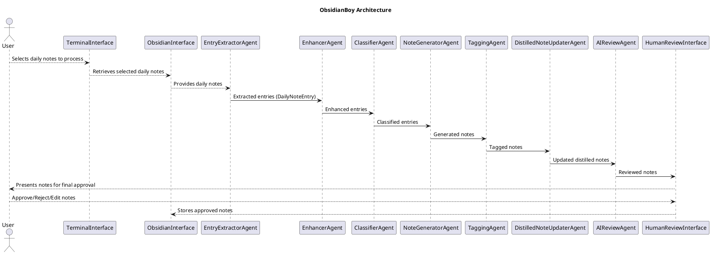
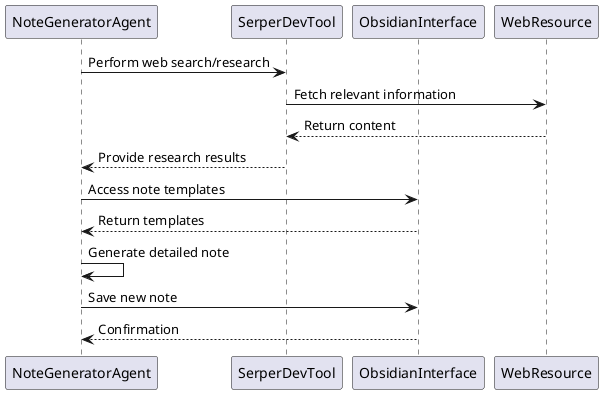

# ObsidianBoy Detailed Project Plan

## System Description

ObsidianBoy is an AI-powered assistant designed to automate the process of managing knowledge in Obsidian, a popular note-taking application. The primary function of ObsidianBoy is to transform daily note entries into comprehensive notes with full explanations and links to relevant resources. It aims to enhance the user's Obsidian vault by enriching daily notes, creating new detailed notes, tagging them appropriately, and updating related distilled notes. The assistant provides a terminal-based interface for users to interact with and supervises the note transformation process through a human-in-the-loop approach.

## High-Level Concept

ObsidianBoy leverages Large Language Models (LLMs) and the crewAI framework to process and enrich daily notes within Obsidian. The application operates by extracting entries from daily notes, performing research to fill in missing information, classifying entries, and generating detailed notes based on predefined templates. It utilizes the capabilities of crewAI to define agents with specific roles and responsibilities, orchestrated through a pipeline that manages the flow of tasks. The system incorporates a feedback loop with AI and human reviews to ensure high-quality output before finalizing changes to the user's Obsidian vault.

## Detailed Concept

### Workflow Overview

1. **User Interaction**: The user interacts with a terminal-based interface to list and select daily notes for processing.

2. **Entry Extraction**: An agent extracts entries from the selected daily notes into a JSON format, conforming to the `DailyNoteEntry` pydantic model.

3. **Information Enhancement**: If important fields are missing (e.g., title, link, description), an agent fills in the gaps by generating appropriate content.

4. **Entry Classification**: An agent classifies each entry and matches it to available note templates based on the type of note (e.g., tech-tool, business-idea, knowledge).

5. **Note Generation**: An agent performs research on each entry using web search and content analysis tools, gathering the necessary information to write detailed notes based on the templates.

6. **Tagging**: An agent tags the new notes by matching them with existing tags in the Obsidian vault.

7. **Distilled Note Update**: An agent identifies and updates relevant distilled notes to include links to the new notes.

8. **AI Review**: An agent reviews the new and updated notes for quality assurance.

9. **Human Review**: The system presents the notes to the user for final review. The user can approve, reject, or edit the notes before they are moved to the Obsidian vault.

### crewAI Integration

The system utilizes the crewAI framework to define agents, tasks, and pipelines. Agents are assigned specific roles and equipped with the necessary tools to perform their tasks. The crewAI pipeline feature allows the combination of multiple crews to handle sequential and parallel tasks efficiently.

- **Agents**: Defined using detailed personas, including their roles, goals, backstories, tools, and configurations.

- **Tasks**: Each agent is assigned tasks that align with their responsibilities within the workflow.

- **Tools**: Agents utilize built-in crewAI tools and custom tools like the `ObsidianInterface` to interact with the Obsidian vault and external resources.

- **Memory**: crewAI's memory system (short-term and long-term memory) is employed to store and recall information throughout the workflow.

- **Pydantic Models**: Classes like `DailyNoteEntry` are defined using pydantic models to enforce structured data exchange between agents.

## Architecture

### Updated PlantUML Diagram



## Agent Personas, Tasks, and Tools

### Agents and Their Responsibilities

1. **EntryExtractorAgent**

   - **Role**: Extract entries from daily notes.
   - **Goal**: Parse selected daily notes and extract individual entries into structured format.
   - **Backstory**: An experienced data parser who specializes in structuring unorganized information.
   - **Tools**: `ObsidianInterface`
   - **Output**: List of `DailyNoteEntry` instances.

2. **EnhancerAgent**

   - **Role**: Enhance entries with missing information.
   - **Goal**: Fill in missing fields in entries, such as generating titles, finding main websites, and summarizing descriptions.
   - **Backstory**: A knowledgeable assistant proficient in content enrichment.
   - **Tools**: Language model capabilities.
   - **Output**: Enhanced `DailyNoteEntry` instances.

3. **ClassifierAgent**

   - **Role**: Classify entries and match them to note templates.
   - **Goal**: Determine the type of each entry and select the appropriate note template.
   - **Backstory**: An organizational expert who categorizes information effectively.
   - **Tools**: Access to note templates, classification algorithms.
   - **Output**: Classified entries with associated templates.

4. **NoteGeneratorAgent**

   - **Role**: Generate detailed notes based on entries.
   - **Goal**: Perform research and write comprehensive notes using the selected templates.
   - **Backstory**: A creative writer and researcher skilled in content creation.
   - **Tools**: Web search tools (`SerperDevTool`), `ObsidianInterface`, language model capabilities.
   - **Output**: New detailed notes.

5. **TaggingAgent**

   - **Role**: Tag new notes appropriately.
   - **Goal**: Assign relevant tags to new notes based on existing tags in the Obsidian vault.
   - **Backstory**: A librarian-like agent with deep knowledge of tagging systems.
   - **Tools**: `ObsidianInterface` to retrieve existing tags.
   - **Output**: Tagged notes.

6. **DistilledNoteUpdaterAgent**

   - **Role**: Update distilled notes to include new links.
   - **Goal**: Identify relevant distilled notes and update them with links to the new notes.
   - **Backstory**: An integrator who maintains the interconnectedness of notes.
   - **Tools**: `ObsidianInterface`, language model capabilities.
   - **Output**: Updated distilled notes.

7. **AIReviewAgent**

   - **Role**: Review notes for quality assurance.
   - **Goal**: Perform an AI-based review of new and updated notes to ensure they meet quality standards.
   - **Backstory**: A meticulous editor focused on maintaining high-quality content.
   - **Tools**: Language model capabilities.
   - **Output**: Reviewed notes with suggested improvements.

8. **HumanReviewInterface**

   - **Role**: Facilitate user review of notes.
   - **Goal**: Present notes to the user for final approval, allowing edits or rejection.
   - **Tools**: Terminal interface.
   - **Output**: Finalized notes.

### crewAI Pipelines and Crews

The system is structured using crewAI pipelines to manage the flow of data and tasks between agents.

- **Pipeline**: A sequence of crews representing different stages of the workflow.
- **Crews**: Groups of agents working together on specific tasks.

#### Pipeline Structure

1. **EntryExtractionCrew**: EntryExtractorAgent
2. **EnhancementCrew**: EnhancerAgent
3. **ClassificationCrew**: ClassifierAgent
4. **NoteGenerationCrew**: NoteGeneratorAgent
5. **TaggingCrew**: TaggingAgent
6. **DistilledNoteUpdatingCrew**: DistilledNoteUpdaterAgent
7. **AIReviewCrew**: AIReviewAgent
8. **HumanReviewCrew**: HumanReviewInterface

## Technology Choices

- **Obsidian**: The note-taking application and vault where notes are stored.
- **Python**: The programming language for development.
- **crewAI Framework**: For defining agents, tasks, crews, and pipelines.
- **Pydantic**: For defining data models (`DailyNoteEntry`).
- **Language Models**: LLMs (e.g., GPT-4) for natural language processing tasks.
- **ObsidianInterface**: Custom tool for interacting with the Obsidian vault.
- **SerperDevTool**: crewAI tool for web search capabilities.
- **PlantUML**: For architecture and sequence diagrams.

## Tasks

### 1. Set Up Project Environment

- **Task**: Initialize the project with the necessary environment and dependencies.
  - Install Python 3.x.
  - Set up a virtual environment.
  - Install required packages: `crewai`, `pydantic`, `plantuml`, `langchain`, etc.

### 2. Define Pydantic Models

- **Task**: Create data models for structured data exchange.
  - Define `DailyNoteEntry` class.
    ```python
    from pydantic import BaseModel, Field
    from typing import List, Optional

    class DailyNoteEntry(BaseModel):
        title: Optional[str] = Field(description="Entry title (optional)")
        link: Optional[str] = Field(description="URL or markdown link (optional)")
        description: Optional[str] = Field(description="Brief description of the entry (optional)")
        tags: List[str] = Field(default_factory=list, description="List of tags (optional, default to empty list)")
        todo: Optional[str] = Field(default=None, description="Optional todo item (null if not present)")
    ```

### 3. Develop ObsidianInterface

- **Task**: Implement methods to interact with Obsidian vault.
  - Methods to include:
    - `list_daily_notes()`
    - `read_daily_note()`
    - `create_temp_note()`
    - `update_note()`
    - `get_existing_tags()`
    - `move_temp_to_vault()`

### 4. Implement Agents

#### EntryExtractorAgent

- **Task**: Extract entries from selected daily notes.
- **Implementation Hints**:
  - Use `ObsidianInterface` to read daily notes.
  - Parse content into `DailyNoteEntry` instances.

#### EnhancerAgent

- **Task**: Enhance entries by filling missing information.
- **Implementation Hints**:
  - Use LLM to generate missing fields.
  - Update `DailyNoteEntry` instances accordingly.

#### ClassifierAgent

- **Task**: Classify entries and assign templates.
- **Implementation Hints**:
  - Implement logic to match entries with note templates.
  - Templates can be stored as markdown files accessible via `ObsidianInterface`.

#### NoteGeneratorAgent

- **Task**: Generate detailed notes using research.
- **Implementation Hints**:
  - Use `SerperDevTool` for web search.
  - Follow templates to structure the notes.
  - Use LLM to compose content based on research.

#### TaggingAgent

- **Task**: Tag new notes based on existing tags.
- **Implementation Hints**:
  - Retrieve existing tags using `ObsidianInterface`.
  - Use LLM to suggest appropriate tags.

#### DistilledNoteUpdaterAgent

- **Task**: Update distilled notes with links to new notes.
- **Implementation Hints**:
  - Identify relevant distilled notes.
  - Insert links to new notes at appropriate places.

#### AIReviewAgent

- **Task**: Review notes for quality.
- **Implementation Hints**:
  - Use LLM to analyze notes for coherence, completeness, and correctness.
  - Suggest improvements if necessary.

#### HumanReviewInterface

- **Task**: Present notes for user review.
- **Implementation Hints**:
  - Implement console prompts for user interactions.
  - Allow options to approve, reject, or edit notes.

### 5. Set Up crewAI Pipelines

- **Task**: Connect agents through pipelines to manage the flow.
- **Implementation Hints**:
  - Use `crewai.Pipeline` to define the sequence of crews.
  - Configure each crew with the respective agent and tasks.

### 6. Implement TerminalInterface

- **Task**: Provide user interface for selecting notes and reviewing outputs.
- **Implementation Hints**:
  - Use Python's `cmd` or `argparse` modules for command-line interactions.
  - Implement functions to display options and capture user input.

### 7. Integrate Memory

- **Task**: Utilize crewAI's memory system.
- **Implementation Hints**:
  - Enable memory in crews where context needs to be shared.
  - Configure short-term and long-term memory as needed.

### 8. Testing and Quality Assurance

- **Task**: Test each component and perform end-to-end testing.
- **Implementation Hints**:
  - Write unit tests for individual agents and methods.
  - Use sample data to simulate the workflow.
  - Verify that notes are correctly generated and stored.

## Implementation Hints

### Crew and Agent Definitions

- **Crew Definition Example**:
  ```python
  from crewai import Crew, Agent, Task

  entry_extractor_agent = Agent(
      role="Entry Extraction Specialist",
      goal="Extract entries from daily notes into structured format.",
      backstory="Expert in parsing and structuring information from notes.",
      tools=[ObsidianInterface()],
      verbose=True
  )

  extract_entries_task = Task(
      description="Extract entries from selected daily notes.",
      agent=entry_extractor_agent,
      output_pydantic=List[DailyNoteEntry]
  )

  entry_extraction_crew = Crew(
      agents=[entry_extractor_agent],
      tasks=[extract_entries_task]
  )
  ```

### Pipeline Setup

- **Pipeline Configuration**:
  ```python
  from crewai import Pipeline

  pipeline = Pipeline(
      stages=[
          entry_extraction_crew,
          enhancement_crew,
          classification_crew,
          note_generation_crew,
          tagging_crew,
          distilled_note_updating_crew,
          ai_review_crew,
          human_review_crew
      ]
  )
  ```

### Utilizing Memory

- **Enable Memory in Crew**:
  ```python
  entry_extraction_crew = Crew(
      agents=[entry_extractor_agent],
      tasks=[extract_entries_task],
      memory=True  # Enable memory for this crew
  )
  ```

### Error Handling in Agents

- **Implement Try-Except Blocks**:
  ```python
  class EnhancerAgent(Agent):
      # Agent properties...

      def execute_task(self, task):
          try:
              # Enhancement logic...
              pass
          except Exception as e:
              self.logger.error(f"Error enhancing entry: {e}")
              # Handle or raise exception as needed
  ```

### Sequence Diagram for Note Generation



### Terminal Interface Implementation

- **User Interaction Example**:
  ```python
  class TerminalInterface:
      def display_menu(self):
          print("ObsidianBoy - Daily Note Processor")
          print("1. List Daily Notes")
          print("2. Select Notes to Process")
          print("3. Exit")

      def get_user_input(self):
          choice = input("Enter your choice: ")
          return choice

      def show_daily_notes(self, notes):
          for idx, note in enumerate(notes):
              print(f"{idx + 1}. {note}")

      def select_daily_notes(self, notes):
          selections = input("Enter note numbers to process (comma-separated): ")
          selected_indices = [int(i.strip()) - 1 for i in selections.split(',')]
          selected_notes = [notes[i] for i in selected_indices]
          return selected_notes
  ```

### Agent Execution Flow

- **Agent Task Flow Example**:
  ```python
  class NoteGeneratorAgent(Agent):
      # Agent properties...

      def execute_task(self, task):
          entry = task.context['entry']
          research_results = self.tools['SerperDevTool'].invoke(entry.link)
          template = self.tools['ObsidianInterface'].get_template(entry.template_type)
          note_content = self.compose_note(entry, research_results, template)
          self.tools['ObsidianInterface'].create_temp_note(note_content)
          return note_content
  ```

---

This detailed project plan outlines the components and steps necessary to implement the ObsidianBoy application using the crewAI framework. By following this plan, an AI coding assistant can proceed to develop the system, ensuring that agents are well-defined, tasks are clear, and the overall architecture supports efficient and effective processing of daily notes into enriched, detailed notes within the Obsidian vault.
