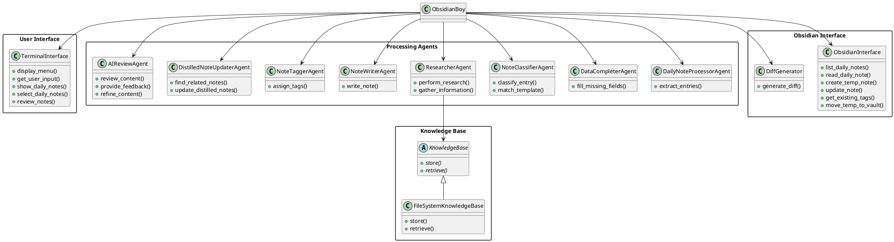

# ObsidianBoy Project Plan

## System Description

ObsidianBoy is an AI-powered assistant designed to automate knowledge management within the Obsidian note-taking application. Its primary function is to transform daily note entries into comprehensive, well-structured notes with detailed explanations and links to relevant resources. By leveraging AI capabilities, ObsidianBoy aids users in organizing their thoughts, research, and inspirations captured in daily notes, converting them into valuable knowledge assets within their Obsidian vaults.

In Obsidian, daily notes are often used as a journal or a place to jot down ideas, inspirations, and findings. These notes typically contain titles, links to resources, descriptions, tags, and tasks for further exploration. ObsidianBoy streamlines the process of expanding these brief entries into detailed notes and integrates them seamlessly into the user's knowledge base.

## High-Level Concept

ObsidianBoy operates through a terminal-based interface, guiding the user to select daily notes for processing. It follows a multi-step workflow involving AI agents that:

1. **Extract entries** from selected daily notes.
2. **Fill in missing information** such as titles, links, and descriptions.
3. **Classify entries** and match them to appropriate note templates.
4. **Perform web research** to gather additional information.
5. **Create new detailed notes** based on research and templates.
6. **Tag new notes** using existing tags in the Obsidian vault.
7. **Update related distilled notes** with new insights.
8. **Conduct an AI review** for quality assurance.
9. **Present the final notes** to the user for human review and approval.

This workflow ensures that each daily note entry is transformed into a comprehensive, interconnected note, enriching the user's knowledge base.

## Detailed Concept

### Workflow Steps:

1. **User Interaction:**
   - The user interacts with ObsidianBoy through a terminal interface.
   - The interface lists available daily notes, allowing the user to select which ones to process.

2. **Entry Extraction:**
   - The **Daily Note Processor Agent** extracts individual entries from the selected daily notes, structuring them into a JSON format.

3. **Data Completion:**
   - The **Data Completer Agent** analyzes each entry to identify missing fields such as the title, link, or description.
   - It employs AI to generate or infer missing information.

4. **Entry Classification:**
   - The **Note Classifier Agent** classifies each entry into predefined categories (e.g., tech-tool, business-idea, knowledge).
   - It matches entries to the appropriate note templates stored in the file system.

5. **Research and Enrichment:**
   - The **Researcher Agent** conducts web searches and scrapes relevant content.
   - It gathers additional information needed to flesh out the notes.

6. **Note Creation:**
   - The **Note Writer Agent** composes new notes using the gathered information and the matched templates.
   - The notes are written in markdown format suitable for Obsidian.

7. **Tagging:**
   - The **Note Tagger Agent** assigns tags to the new notes based on existing tags in the Obsidian vault.

8. **Distilled Note Updating:**
   - The **Distilled Note Updater Agent** identifies related distilled notes.
   - It updates them with new insights and links to the newly created notes.

9. **AI Review Loop:**
   - The **AI Review Agent** reviews the new and updated notes for coherence, correctness, and quality.
   - If issues are found, it provides feedback for refinement.

10. **Human Review:**
    - The updated notes are saved in a temporary directory.
    - The user is presented with a diff of changes for distilled notes and previews of new notes.
    - The user can approve, reject, or modify the notes before they are moved into the main vault.

## Architecture

### Updated PlantUML Diagram



### Architecture Description

- **ObsidianBoy**: The main orchestrator managing the workflow and coordinating agents.
- **TerminalInterface**: Handles user interactions through the terminal.
- **ObsidianInterface**: Provides access to the Obsidian vault's file system for reading and writing notes.
- **Processing Agents**: A collection of agents, each responsible for specific tasks in the workflow as outlined in the "Detailed Concept" section.
- **KnowledgeBase**: Stores and retrieves research data. Implemented as a file-based storage in the initial version.

## Agent Personas, Tasks, and Tools

### 1. **User Interface Agent (TerminalInterface)**

- **Role**: Interact with the user, display options, and collect input.
- **Tasks**:
  - Display a list of daily notes.
  - Allow selection of notes to process.
  - Present final notes for human review.
- **Tools**:
  - Terminal I/O operations.

### 2. **Daily Note Processor Agent**

- **Role**: Extract entries from selected daily notes.
- **Tasks**:
  - Parse daily notes into structured entries.
  - Convert entries into JSON format.
- **Tools**:
  - File reading.
  - Text parsing libraries.

### 3. **Data Completer Agent**

- **Role**: Fill in missing information in entries.
- **Tasks**:
  - Identify missing fields (title, link, description).
  - Generate or infer missing data using AI.
- **Tools**:
  - Language models for text generation.

### 4. **Note Classifier Agent**

- **Role**: Classify entries and match them to note templates.
- **Tasks**:
  - Determine the type of each entry.
  - Select appropriate markdown template.
- **Tools**:
  - Classification algorithms.
  - Access to note templates.

### 5. **Researcher Agent**

- **Role**: Gather additional information through web research.
- **Tasks**:
  - Perform web searches based on entry data.
  - Scrape relevant content from websites.
  - Analyze and summarize gathered information.
- **Tools**:
  - Web scraping libraries.
  - Search APIs.
  - Content analysis tools.

### 6. **Note Writer Agent**

- **Role**: Compose new detailed notes.
- **Tasks**:
  - Populate note templates with gathered information.
  - Ensure notes are coherent and well-structured.
- **Tools**:
  - Language models for text generation.
  - Template engines.

### 7. **Note Tagger Agent**

- **Role**: Assign appropriate tags to new notes.
- **Tasks**:
  - Analyze content to determine relevant tags.
  - Match tags with existing ones in Obsidian.
- **Tools**:
  - Tag extraction algorithms.
  - Access to existing tags.

### 8. **Distilled Note Updater Agent**

- **Role**: Update distilled notes with new insights.
- **Tasks**:
  - Identify related distilled notes.
  - Integrate new information and links.
- **Tools**:
  - Note linking algorithms.
  - Text merging tools.

### 9. **AI Review Agent**

- **Role**: Review content for quality assurance.
- **Tasks**:
  - Check notes for coherence, correctness, and completeness.
  - Provide feedback for refinements.
- **Tools**:
  - Language models for text analysis.
  - Quality assessment criteria.

### 10. **Human Reviewer**

- **Role**: Final approval and adjustment of notes.
- **Tasks**:
  - Review diffs of updated distilled notes.
  - Approve, reject, or edit new notes.
- **Tools**:
  - Terminal interface for reviewing notes.
  - Text editors if manual edits are required.

## Technology Choices

### Reasoning and Selection

Given the requirements and the desired workflow, the following technology choices are proposed:

- **Programming Language**: Python
  - **Rationale**: Python offers extensive libraries for AI, web scraping, and text processing. It's also widely used for scripting and automation.

- **AI Framework**:
  - **LangChain and LangGraph**: For orchestrating LLM interactions and agent workflows.
    - **Rationale**: LangGraph provides a graph-based control flow suitable for combining single LLM executions and agent loops, offering flexibility and control.
  - **Alternative**: CrewAI
    - **Rationale**: While CrewAI is a multi-agent framework, LangGraph is preferred for its controllability and suitability for the defined agentic workflow.

- **Language Models**:
  - Use appropriate AI models for each task.
    - Simple models for summarization and data completion.
    - More capable models for tasks like planning and content generation.

- **Obsidian Integration**:
  - File system operations for reading and writing markdown files in the Obsidian vault.

- **Web Scraping**:
  - Libraries like BeautifulSoup or Scrapy for scraping web content.

- **Terminal Interface**:
  - Use standard input/output for the initial interface.
  - Consider libraries like `curses` for enhanced terminal UI if needed.

- **Data Storage**:
  - Implement a file-based knowledge base for storing research data.
  - Consider expanding to use a more robust storage solution if needed.

- **Version Control**:
  - Git for tracking changes, especially for reviewing diffs of distilled notes.

## Tasks

### Task Breakdown

1. **Set Up Project Environment**
   - Initialize a Python project with the necessary dependencies.
   - Configure virtual environments and manage packages.

2. **Develop Terminal Interface**
   - Implement the **TerminalInterface** class.
     - **Subtasks**:
       - Display menu options.
       - List daily notes from the Obsidian vault.
       - Allow selection of notes to process.
       - Display notes for human review.

3. **Implement Obsidian Interface**
   - Develop the **ObsidianInterface** class.
     - **Subtasks**:
       - Access and read daily notes.
       - Write new and updated notes.
       - Retrieve existing tags.
       - Move notes from the temporary directory to the main vault.

4. **Build Processing Agents**
   - **Daily Note Processor Agent**
     - Extract entries from daily notes into JSON format.
   - **Data Completer Agent**
     - Fill in missing fields in entries.
   - **Note Classifier Agent**
     - Classify entries and match to templates.
   - **Researcher Agent**
     - Perform web searches and gather information.
     - **Subtasks**:
       - Integrate web scraping libraries.
       - Implement search APIs integration.
   - **Note Writer Agent**
     - Generate notes based on templates and research.
   - **Note Tagger Agent**
     - Assign tags to new notes.
   - **Distilled Note Updater Agent**
     - Update existing distilled notes with new information.
   - **AI Review Agent**
     - Implement the review loop for quality assurance.

5. **Integrate Agents into Workflow**
   - Orchestrate the agents using LangGraph.
     - **Subtasks**:
       - Define the graph structure and control flow.
       - Implement conditional edges and decision points.
       - Ensure proper state management across agents.

6. **Implement Knowledge Base**
   - Develop the **KnowledgeBase** abstract class and **FileSystemKnowledgeBase** concrete implementation.
     - **Subtasks**:
       - Implement methods to store and retrieve data.
       - Ensure data is properly accessed by the Researcher Agent.

7. **Create Note Templates**
   - Define markdown templates for different note types.
     - **Subtasks**:
       - Create templates with placeholders and hints.
       - Store templates in an accessible file system location.

8. **Implement AI Models and Prompts**
   - Configure language models for each agent.
     - **Subtasks**:
       - Design prompts for data completion, classification, note writing, and review.
       - Select appropriate models for each task balancing capability and cost.

9. **Implement AI Review Loop**
   - Develop the feedback loop mechanism.
     - **Subtasks**:
       - Allow the AI Review Agent to provide feedback.
       - Enable agents to refine outputs based on feedback.

10. **Develop Human Review Interface**
    - Enhance the TerminalInterface to support human review.
      - **Subtasks**:
        - Present diffs for distilled notes.
        - Allow users to approve, reject, or edit notes.

11. **Test and Debug**
    - Conduct thorough testing of each component and the overall workflow.
      - **Subtasks**:
        - Write unit tests for individual classes and methods.
        - Perform integration testing.
        - Debug and fix issues.

12. **Documentation**
    - Document the codebase and provide usage instructions.
      - **Subtasks**:
        - Write docstrings and comments.
        - Create a README with setup and usage guidelines.

13. **Future Enhancements (Optional)**
    - Consider implementing a graphical user interface (GUI).
    - Explore integration with Obsidian plugins or APIs.
    - Implement more advanced AI models or integrate with a RAG system.

## Implementation Hints

### Workflow Orchestration with LangGraph

- **Define the Graph Structure**:

  - Use LangGraph to model the workflow as a graph where each node represents an agent.
  - Define the state schema that will be passed between agents.

    ```python
    from typing import TypedDict, List, Optional
    from langgraph.graph import StateGraph

    class AppState(TypedDict):
        selected_notes: List[str]
        entries: List[dict]
        notes_to_review: List[str]
        # Add additional keys as needed.

    graph = StateGraph(AppState)
    ```

- **Add Nodes (Agents) to the Graph**:

  - Implement each agent as a function that takes the state as input and returns an updated state.

    ```python
    def daily_note_processor(state: AppState):
        # Extract entries from selected daily notes.
        # Update state['entries'].
        return {"entries": updated_entries}
    ```

  - Add the node to the graph:

    ```python
    graph.add_node("daily_note_processor", daily_note_processor)
    ```

- **Define Edges and Control Flow**:

  - Use conditional edges to determine the next agent based on the state.

    ```python
    def decide_next_agent(state: AppState):
        if condition:
            return "data_completer"
        else:
            return "end"

    graph.add_conditional_edges("daily_note_processor", decide_next_agent)
    ```

- **Implement Breakpoints for Human Review**:

  - Use LangGraph's checkpointing and breakpoints to pause execution for human input.

### Agent Implementation Tips

- **Data Completer Agent**:

  - Use language models to generate missing data.
  - Design prompts that clearly instruct the model on the desired output.

    ```python
    prompt = (
        "Given the following entry with missing fields, fill in the missing information:\n"
        "{entry}"
    )
    ```

- **Researcher Agent**:

  - Integrate search APIs (e.g., Google Custom Search API) for web searches.
  - Use libraries like BeautifulSoup for parsing HTML content.

    ```python
    import requests
    from bs4 import BeautifulSoup

    def perform_research(query):
        response = requests.get(search_url)
        soup = BeautifulSoup(response.text, 'html.parser')
        # Extract relevant information.
    ```

- **Note Writer Agent**:

  - Use templates and fill in placeholders with gathered information.
  - Ensure the text generated is coherent and follows the structure.

- **Note Tagger Agent**:

  - Compare keywords in the note content with existing tags.
  - Use simple NLP techniques or AI models for tag extraction.

- **AI Review Agent**:

  - Implement quality checks, possibly by re-prompting the model to critique the content.

    ```python
    review_prompt = (
        "Review the following note for coherence, correctness, and completeness:\n"
        "{note_content}\n"
        "Provide feedback or confirm it's ready."
    )
    ```

### Persistent Storage and Knowledge Base

- **KnowledgeBase Implementation**:

  - Design methods to store research results in a structured way.
  - Consider using JSON files or a lightweight database.

- **File Operations**:

  - Ensure all file paths are correctly handled.
  - Use context managers when working with files for safety.

### Human Review Interface

- **Diff Generation**:

  - Use libraries like `difflib` to generate diffs between the original and updated notes.

    ```python
    import difflib

    def generate_diff(original, updated):
        diff = difflib.unified_diff(
            original.splitlines(), updated.splitlines(),
            fromfile='Original', tofile='Updated',
            lineterm=''
        )
        return '\n'.join(diff)
    ```

- **User Input Handling**:

  - Keep prompts clear and concise.
  - Validate user input to prevent errors.

### Logging and Error Handling

- Implement logging to track the workflow's progress.
- Handle exceptions gracefully, especially in web requests and AI model invocations.

### Testing

- **Unit Tests**:

  - Write tests for each agent's functionality.
  - Mock external dependencies like web requests and AI model responses.

- **Integration Tests**:

  - Simulate the workflow with sample data.
  - Ensure that data flows correctly between agents.

## Conclusion

This project plan outlines the development of ObsidianBoy, an AI assistant that automates the enhancement of daily notes in Obsidian. By following the detailed architecture, leveraging selected technologies, and implementing the tasks and agents as described, the AI coding assistant can systematically build the application. The implementation hints provide guidance on integrating the various components, ensuring a cohesive and functional system.
