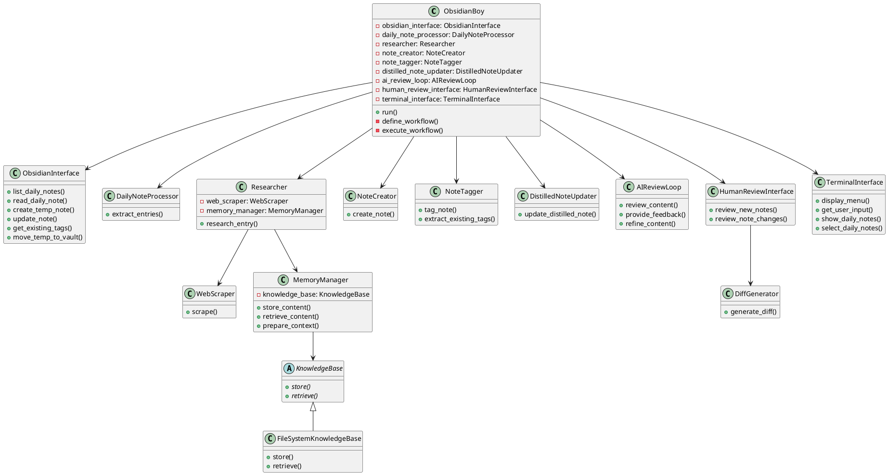

<objective>
Create a detailled project plan for the ObsidianBoy application as outlined in the existing project plan that is more of draft. The project will be implemented by an AI coding assistant based on the project plan you generate. 
- Create a detailed concept including the agent responsibilities and description of the agent personas, their tasks and tools.
- Reason about the technology choices based in the given high level information and choose the technologies to be used.
- Update the PlantUML architecture diagram. Break down the project into tasks that the coding agent can work on task by task. Generate subtasks for complex tasks.
- Provide implementation guidance. Probably only high level pseudo code or PlantUML activity or sequence diagrams, enough for an AI coding assistant to get the right idea. Don't generate production code.
</objective>

<project-plan>
# ObsidianBoy Project Plan

## Project Overview

An AI-powered assistant (ObsidianBoy) that automates the process of managing knowledge in Obsidian. The goal is to transform daily note entries into compreghensive notes with full explanation and links to relevant resources. The assistant will allow users to select daily notes to process, perform research on daily note entries, create new discrete notes for each entry, tag them based on existing tags, and update related distilled notes. There shall be an AI review feedback loop, followed by a final human review step before finalizing changes. In the first iteration the interface will be terminal-based.

Obsidian background:
Obsidian is a note taking app that stores the notes as markdown files in a vault. In Obsidian daily notes are like bookmarks of ideas or inspirations used to capture findings or ideas. Usually daily notes contain a title, a link to relevant resources and a description, probably also tags and a task to remind the user on further exploration. Distilled notes are covering a bigger topic with more depth and are usually linking to related detailled notes.

## Envisoned Workflow

1. The terminal based interface allows the user to list and select daily notes to be processed.
2. An LLM extracts entries from daily notes into a JSON format.
3. If important fields are missing, an LLM tries to fill the gaps like generating a title, finding the main website, summary of the entry.
4. An LLM classifies the entry and matches it to available note templates for different types of notes like tech-tool, business-idea, knowledge. The templates in markdown format are available in the file system and contain descriptions for the content of each section as a hint for the note writer LLM. 
5. The note writer LLM performs research on each entry using web search, scraping and content analysis to gather the needed information and then writes the note based on the template using the researched knowledge.
6. An LLM tags new notes based on existing tags in Obsidian
7. An LLM finds and updates relevant distilled notes
9. A feedback loop with an LLM review to ensure high quality
10. New notes and updated distilled notes sre stored in a temp directory and then presented to the human for review. For the distilled notes a diff with the changes is shown. The human can approve, reject or keep new notes in the temp dir for manual editing.

## Solution Proposals

The solution is probably a mixture of fixed steps from the workflow while others may be better solved with an agentic approach. Probably LLM driven planning steps are beneficial. To be cost efficient the solution should use appropriate intelligent AI models for each step, ranging from simple and cheap models for easy tasks like summarization to more expensive capable models like planning. Probably memory should be added to the agents. All this has a huge impact on the technology choices. One candidate is to implement the solution with LangChain and LangGraph, the latter providing a graph based LLM control flow that allows a combination of single LLM executions and agent loops. Another contender is CrewAI, a multi-agent framework based on LangChain. CrewAI can be combined with LangGraph, crews could be executed by LangGraph nodes.

## Architecture
This a a rough architecture draft, mostly covering the interface and LLM tools. The knowledge base is an abstract class that allows a simple file based knowledge base approach where the researched knowledge is stored in files that subsequently could be added to the context of LLM requests. Another implementation could use RAG. Some classes and methods are placeholders because the agentic flow was unclear at the time. The tools are partly implemented.



## Class Descriptions

1. **ObsidianBoy**: The main orchestrator class. It creates and manages instances of all other components. It defines and executes the overall workflow using LangGraph.

2. **ObsidianInterface**: Handles all interactions with the Obsidian vault file system.

3. **DailyNoteProcessor**: Processes daily notes and extracts entries.

4. **Researcher**: Orchestrates the research process for entries. It contains instances of WebScraper and MemoryManager.

5. **WebScraper**: Responsible for scraping content from web resources.

6. **KnowledgeBase**: Abstract base class for knowledge storage and retrieval.

7. **FileSystemKnowledgeBase**: Concrete implementation of KnowledgeBase that stores data in the file system.

8. **MemoryManager**: Manages the storage and retrieval of content, and prepares context for LLM processing. It has an instance of KnowledgeBase.

9. **NoteCreator**, **NoteTagger**, **DistilledNoteUpdater**: Handle various aspects of note creation and management.

10. **AIReviewLoop**: Implements the AI review feedback loop using LangGraph.

11. **HumanReviewInterface**: Handles the human review process, including presenting diffs for approval.

12. **DiffGenerator**: Generates diffs between original and updated notes.

13. **TerminalInterface**: Manages all terminal-based user interactions.

## Types and Templates
### The daily note entry type
```python
class DailyNoteEntry(BaseModel):
    title: Optional[str] = Field(description="Entry title (optional)")
    link: Optional[str] = Field(description="URL or markdown link (optional)")
    description: Optional[str] = Field(description="Brief description of the entry (optional)")
    tags: List[str] = Field(default_factory=list, description="List of tags (optional, default to empty list)")
    todo: Optional[str] = Field(default=None, description="Optional todo item (null if not present)")
```
Important fields that should be fileld if missing: title, link, description\

### Note template example
LLM hints for the content are in {{}}
tech-tool.md
```
---
created: {current date}
updated: {current date}
type: tech-tool
tags: {{tags}}
description: {{short description of the tech-tool}}
---
# Description
{{long description of the tech-tool}}
## Concepts
{{explanation of the concepts used by the tech-tool}}
## Usages
{{explanation of the usages of the tech-tool}}
# Resources
## Official
{{bulleted list of links to official resources: the project main website, source code, webapp, documentation, research papers}}
## Know-How
{{bulleted list of links to know-how resources: articles, courses, blog-posts, medium, substack, YouTube, podcasts, linkedin}}
```
</project-plan>

<technologies>
<LangGraph>
# LangGraph for Agentic Applications

## What does it mean to be agentic?

Other people may talk about a system being an "agent" - we prefer to talk about systems being "agentic". But what does this actually mean?

When we talk about systems being "agentic", we are talking about systems that use an LLM to decide the control flow of an application. There are different levels that an LLM can be used to decide the control flow, and this spectrum of "agentic" makes more sense to us than defining an arbitrary cutoff for what is or isn't an agent.

Examples of using an LLM to decide the control of an application:

- Using an LLM to route between two potential paths
- Using an LLM to decide which of many tools to call
- Using an LLM to decide whether the generated answer is sufficient or more work is need

The more times these types of decisions are made inside an application, the more agentic it is.
If these decisions are being made in a loop, then its even more agentic!

There are other concepts often associated with being agentic, but we would argue these are a by-product of the above definition:

- [Tool calling](agentic_concepts.md#tool-calling): this is often how LLMs make decisions
- Action taking: often times, the LLMs' outputs are used as the input to an action
- [Memory](agentic_concepts.md#memory): reliable systems need to have knowledge of things that occurred
- [Planning](agentic_concepts.md#planning): planning steps (either explicit or implicit) are useful for ensuring that the LLM, when making decisions, makes them in the highest fidelity way.

## Why LangGraph?

LangGraph has several core principles that we believe make it the most suitable framework for building agentic applications:

- [Controllability](../how-tos/index.md#controllability)
- [Human-in-the-Loop](../how-tos/index.md#human-in-the-loop)
- [Streaming First](../how-tos/index.md#streaming)

**Controllability**

LangGraph is extremely low level. This gives you a high degree of control over what the system you are building actually does. We believe this is important because it is still hard to get agentic systems to work reliably, and we've seen that the more control you exercise over them, the more likely it is that they will "work".

**Human-in-the-Loop**

LangGraph comes with a built-in persistence layer as a first-class concept. This enables several different human-in-the-loop interaction patterns. We believe that "Human-Agent Interaction" patterns will be the new "Human-Computer Interaction", and have built LangGraph with built in persistence to enable this.

**Streaming First**

LangGraph comes with first class support for streaming. Agentic applications often take a while to run, and so giving the user some idea of what is happening is important, and streaming is a great way to do that. LangGraph supports streaming of both events ([like a tool call being taken](../how-tos/stream-updates.ipynb)) as well as of [tokens that an LLM may emit](../how-tos/streaming-tokens.ipynb).
# Common Agentic Patterns

## Structured Output

It's pretty common to want LLMs inside nodes to return structured output when building agents. This is because that structured output can often be used to route to the next step (e.g. choose between two different edges) or update specific keys of the state.

Since LangGraph nodes can be arbitrary Python functions, you can do this however you want. If you want to use LangChain, [this how-to guide](https://python.langchain.com/v0.2/docs/how_to/structured_output/) is a starting point.

## Tool calling

It's extremely common to want agents to do tool calling. Tool calling refers to choosing from several available tools, and specifying which ones to call and what the inputs should be. This is extremely common in agents, as you often want to let the LLM decide which tools to call and then call those tools.

Since LangGraph nodes can be arbitrary Python functions, you can do this however you want. If you want to use LangChain, [this how-to guide](https://python.langchain.com/v0.2/docs/how_to/tool_calling/) is a starting point.

## Memory

Memory is a key concept to agentic applications. Memory is important because end users often expect the application they are interacting with remember previous interactions. The most simple example of this is chatbots - they clearly need to remember previous messages in a conversation.

LangGraph is perfectly suited to give you full control over the memory of your application. With user defined [`State`](./low_level.md#state) you can specify the exact schema of the memory you want to retain. With [checkpointers](./low_level.md#checkpointer) you can store checkpoints of previous interactions and resume from there in follow up interactions.

See [this guide](../how-tos/persistence.ipynb) for how to add memory to your graph.

## Human-in-the-loop

Agentic systems often require some human-in-the-loop (or "on-the-loop") interaction patterns. This is because agentic systems are still not super reliable, so having a human involved is required for any sensitive tasks/actions. These are all easily enabled in LangGraph, largely due to [checkpointers](./low_level.md#checkpointer). The reason a checkpointer is necessary is that a lot of these interaction patterns involve running a graph up until a certain point, waiting for some sort of human feedback, and then continuing. When you want to "continue" you will need to access the state of the graph previous to getting interrupted, and checkpointers are a built in, highly convenient way to do that.

There are a few common human-in-the-loop interaction patterns we see emerging.

### Approval

A basic one is to have the agent wait for approval before executing certain tools. This may be all tools, or just a subset of tools. This is generally recommend for more sensitive actions (like writing to a database). This can easily be done in LangGraph by setting a [breakpoint](./low_level.md#breakpoints) before specific nodes.

See [this guide](../how-tos/human_in_the_loop/breakpoints.ipynb) for how do this in LangGraph.

### Wait for input

A similar one is to have the agent wait for human input. This can be done by:

1. Create a node specifically for human input
2. Add a breakpoint before the node
3. Get user input
4. Update the state with that user input, acting as that node
5. Resume execution

See [this guide](../how-tos/human_in_the_loop/wait-user-input.ipynb) for how do this in LangGraph.

### Edit agent actions

This is a more advanced interaction pattern. In this interaction pattern the human can actually edit some of the agent's previous decisions. This can be done either during the flow (after a [breakpoint](./low_level.md#breakpoints), part of the [approval](#approval) flow) or after the fact (as part of [time-travel](#time-travel))

See [this guide](../how-tos/human_in_the_loop/edit-graph-state.ipynb) for how do this in LangGraph.

### Time travel

This is a pretty advanced interaction pattern. In this interaction pattern, the human can look back at the list of previous checkpoints, find one they like, optionally [edit it](#edit-agent-actions), and then resume execution from there.

See [this guide](../how-tos/human_in_the_loop/time-travel.ipynb) for how to do this in LangGraph.

## Review Tool Calls

This is a specific type of human-in-the-loop interaction but it's worth calling out because it is so common. A lot of agent decisions are made via tool calling, so having a clear UX for reviewing tool calls is handy.

A tool call consists of:
- The name of the tool to call
- Arguments to pass to the tool

Note that these tool calls can obviously be used for actually calling functions, but they can also be used for other purposes, like to route the agent in a specific direction.
You will want to review the tool call for both of these use cases.

When reviewing tool calls, there are few actions you may want to take.

1. Approve the tool call (and let the agent continue on its way)
2. Manually change the tool call, either the tool name or the tool arguments (and let the agent continue on its way after that)
3. Leave feedback on the tool call. This differs from (2) in that you are not changing the tool call directly, but rather leaving natural language feedback suggesting the LLM call it differently (or call a different tool). You could do this by either adding a `ToolMessage` and having the feedback be the result of the tool call, or by adding a `ToolMessage` (that simulates an error) and then a `HumanMessage` (with the feedback).

See [this guide](../how-tos/human_in_the_loop/review-tool-calls.ipynb) for how to do this in LangGraph.

## Map-Reduce

A common pattern in agents is to generate a list of objects, do some work on each of those objects, and then combine the results. This is very similar to the common [map-reduce](https://en.wikipedia.org/wiki/MapReduce) operation. This can be tricky for a few reasons. First, it can be tough to define a structured graph ahead of time because the length of the list of objects may be unknown. Second, in order to do this map-reduce you need multiple versions of the state to exist... but the graph shares a common shared state, so how can this be?

LangGraph supports this via the [Send](./low_level.md#send) api. This can be used to allow a conditional edge to Send multiple different states to multiple nodes. The state it sends can be different from the state of the core graph.

See a how-to guide for this [here](../how-tos/map-reduce.ipynb)

## Multi-agent

A term you may have heard is "multi-agent" architectures. What exactly does this mean?

Given that it is hard to even define an "agent", it's almost impossible to exactly define a "multi-agent" architecture. When most people talk about a multi-agent architecture, they typically mean a system where there are multiple different LLM-based systems. These LLM-based systems can be as simple as a prompt and an LLM call, or as complex as a [ReAct agent](#react-agent).

The big question in multi-agent systems is how they communicate. This involves both the schema of how they communicate, as well as the sequence in which they communicate. LangGraph is perfect for orchestrating these types of systems. It allows you to define multiple agents (each one is a node) an arbitrary state (to encapsulate the schema of how they communicate) as well as the edges (to control the sequence in which they communicate).

## Planning

One of the big things that agentic systems struggle with is long term planning. A common technique to overcome this is to have an explicit planning this. This generally involves calling an LLM to come up with a series of steps to execute. From there, the system then tries to execute the series of tasks (this could use a sub-agent to do so). Optionally, you can revisit the plan after each step and update it if needed.

## Reflection

Agents often struggle to produce reliable results. Therefore, it can be helpful to check whether the agent has completed a task correctly or not. If it has - then you can finish. If it hasn't - then you can take the feedback on why it's not correct and pass it back into another iteration of the agent.

This "reflection" step often uses an LLM, but doesn't have to. A good example of where using an LLM may not be necessary is in coding, when you can try to compile the generated code and use any errors as the feedback.

## ReAct Agent

One of the most common agent architectures is what is commonly called the ReAct agent architecture. In this architecture, an LLM is called repeatedly in a while-loop. At each step the agent decides which tools to call, and what the inputs to those tools should be. Those tools are then executed, and the outputs are fed back into the LLM as observations. The while-loop terminates when the agent decides it is not worth calling any more tools.

One of the few high level, pre-built agents we have in LangGraph - you can use it with [`create_react_agent`](../reference/prebuilt.md#create_react_agent)

This is named after and based on the [ReAct](https://arxiv.org/abs/2210.03629) paper. However, there are several differences between this paper and our implementation:

- First, we use [tool-calling](#tool-calling) to have LLMs call tools, whereas the paper used prompting + parsing of raw output. This is because tool calling did not exist when the paper was written, but is generally better and more reliable.
- Second, we use messages to prompt the LLM, whereas the paper used string formatting. This is because at the time of writing, LLMs didn't even expose a message-based interface, whereas now that's the only interface they expose.
- Third, the paper required all inputs to the tools to be a single string. This was largely due to LLMs not being super capable at the time, and only really being able to generate a single input. Our implementation allows for using tools that require multiple inputs.
- Forth, the paper only looks at calling a single tool at the time, largely due to limitations in LLMs performance at the time. Our implementation allows for calling multiple tools at a time.
- Finally, the paper asked the LLM to explicitly generate a "Thought" step before deciding which tools to call. This is the "Reasoning" part of "ReAct". Our implementation does not do this by default, largely because LLMs have gotten much better and that is not as necessary. Of course, if you wish to prompt it do so, you certainly can.

See [this guide](../how-tos/human_in_the_loop/time-travel.ipynb) for a full walkthrough of how to use the prebuilt ReAct agent.
# Low Level Conceptual Guide

## Graphs

At its core, LangGraph models agent workflows as graphs. You define the behavior of your agents using three key components:

1. [`State`](#state): A shared data structure that represents the current snapshot of your application. It can be any Python type, but is typically a `TypedDict` or Pydantic `BaseModel`.

2. [`Nodes`](#nodes): Python functions that encode the logic of your agents. They receive the current `State` as input, perform some computation or side-effect, and return an updated `State`.

3. [`Edges`](#edges): Python functions that determine which `Node` to execute next based on the current `State`. They can be conditional branches or fixed transitions.

By composing `Nodes` and `Edges`, you can create complex, looping workflows that evolve the `State` over time. The real power, though, comes from how LangGraph manages that `State`. To emphasize: `Nodes` and `Edges` are nothing more than Python functions - they can contain an LLM or just good ol' Python code.

In short: _nodes do the work. edges tell what to do next_.

LangGraph's underlying graph algorithm uses [message passing](https://en.wikipedia.org/wiki/Message_passing) to define a general program. When a Node completes its operation, it sends messages along one or more edges to other node(s). These recipient nodes then execute their functions, pass the resulting messages to the next set of nodes, and the process continues. Inspired by Google's [Pregel](https://research.google/pubs/pregel-a-system-for-large-scale-graph-processing/) system, the program proceeds in discrete "super-steps."

A super-step can be considered a single iteration over the graph nodes. Nodes that run in parallel are part of the same super-step, while nodes that run sequentially belong to separate super-steps. At the start of graph execution, all nodes begin in an `inactive` state. A node becomes `active` when it receives a new message (state) on any of its incoming edges (or "channels"). The active node then runs its function and responds with updates. At the end of each super-step, nodes with no incoming messages vote to `halt` by marking themselves as `inactive`. The graph execution terminates when all nodes are `inactive` and no messages are in transit.

### StateGraph

The `StateGraph` class is the main graph class to uses. This is parameterized by a user defined `State` object.

### MessageGraph

The `MessageGraph` class is a special type of graph. The `State` of a `MessageGraph` is ONLY a list of messages. This class is rarely used except for chatbots, as most applications require the `State` to be more complex than a list of messages.

### Compiling your graph

To build your graph, you first define the [state](#state), you then add [nodes](#nodes) and [edges](#edges), and then you compile it. What exactly is compiling your graph and why is it needed?

Compiling is a pretty simple step. It provides a few basic checks on the structure of your graph (no orphaned nodes, etc). It is also where you can specify runtime args like [checkpointers](#checkpointer) and [breakpoints](#breakpoints). You compile your graph by just calling the `.compile` method:

```python
graph = graph_builder.compile(...)
```

You **MUST** compile your graph before you can use it.

## State

The first thing you do when you define a graph is define the `State` of the graph. The `State` consists of the [schema of the graph](#schema) as well as [`reducer` functions](#reducers) which specify how to apply updates to the state. The schema of the `State` will be the input schema to all `Nodes` and `Edges` in the graph, and can be either a `TypedDict` or a `Pydantic` model. All `Nodes` will emit updates to the `State` which are then applied using the specified `reducer` function.

### Schema

The main documented way to specify the schema of a graph is by using `TypedDict`. However, we also support [using a Pydantic BaseModel](../how-tos/state-model.ipynb) as your graph state to add **default values** and additional data validation.

By default, the graph will have the same input and output schemas. If you want to change this, you can also specify explicit input and output schemas directly. This is useful when you have a lot of keys, and some are explicitly for input and others for output. See the [notebook here](../how-tos/input_output_schema.ipynb) for how to use.

By default, all nodes in the graph will share the same state. This means that they will read and write to the same state channels. It is possible to have nodes write to private state channels inside the graph for internal node communication - see [this notebook](../how-tos/pass_private_state.ipynb) for how to do that.

### Reducers

Reducers are key to understanding how updates from nodes are applied to the `State`. Each key in the `State` has its own independent reducer function. If no reducer function is explicitly specified then it is assumed that all updates to that key should override it. There are a few different types of reducers, starting with the default type of reducer:

#### Default Reducer

These two examples show how to use the default reducer:

**Example A:**

```python
from typing import TypedDict

class State(TypedDict):
    foo: int
    bar: list[str]
```

In this example, no reducer functions are specified for any key. Let's assume the input to the graph is `{"foo": 1, "bar": ["hi"]}`. Let's then assume the first `Node` returns `{"foo": 2}`. This is treated as an update to the state. Notice that the `Node` does not need to return the whole `State` schema - just an update. After applying this update, the `State` would then be `{"foo": 2, "bar": ["hi"]}`. If the second node returns `{"bar": ["bye"]}` then the `State` would then be `{"foo": 2, "bar": ["bye"]}`

**Example B:**

```python
from typing import TypedDict, Annotated
from operator import add

class State(TypedDict):
    foo: int
    bar: Annotated[list[str], add]
```

In this example, we've used the `Annotated` type to specify a reducer function (`operator.add`) for the second key (`bar`). Note that the first key remains unchanged. Let's assume the input to the graph is `{"foo": 1, "bar": ["hi"]}`. Let's then assume the first `Node` returns `{"foo": 2}`. This is treated as an update to the state. Notice that the `Node` does not need to return the whole `State` schema - just an update. After applying this update, the `State` would then be `{"foo": 2, "bar": ["hi"]}`. If the second node returns `{"bar": ["bye"]}` then the `State` would then be `{"foo": 2, "bar": ["hi", "bye"]}`. Notice here that the `bar` key is updated by adding the two lists together.

#### Context Reducer

You can use `Context` channels to define shared resources (such as database connections) that are managed outside of your graph's nodes and excluded from checkpointing. The context manager provided to the Context channel is entered before the first step of the graph execution and exited after the last step, allowing you to set up and clean up resources for the duration of the graph invocation. Read this [how to](https://langchain-ai.github.io/langgraph/how-tos/state-context-key) to see an example of using the `Context` channel in your graph.

### Working with Messages in Graph State

#### Why use messages?

Most modern LLM providers have a chat model interface that accepts a list of messages as input. LangChain's [`ChatModel`](https://python.langchain.com/v0.2/docs/concepts/#chat-models) in particular accepts a list of `Message` objects as inputs. These messages come in a variety of forms such as `HumanMessage` (user input) or `AIMessage` (LLM response). To read more about what message objects are, please refer to [this](https://python.langchain.com/v0.2/docs/concepts/#messages) conceptual guide.

#### Using Messages in your Graph

In many cases, it is helpful to store prior conversation history as a list of messages in your graph state. To do so, we can add a key (channel) to the graph state that stores a list of `Message` objects and annotate it with a reducer function (see `messages` key in the example below). The reducer function is vital to telling the graph how to update the list of `Message` objects in the state with each state update (for example, when a node sends an update). If you don't specify a reducer, every state update will overwrite the list of messages with the most recently provided value. If you wanted to simply append messages to the existing list, you could use `operator.add` as a reducer.

However, you might also want to manually update messages in your graph state (e.g. human-in-the-loop). If you were to use `operator.add`, the manual state updates you send to the graph would be appended to the existing list of messages, instead of updating existing messages. To avoid that, you need a reducer that can keep track of message IDs and overwrite existing messages, if updated. To achieve this, you can use the prebuilt `add_messages` function. For brand new messages, it will simply append to existing list, but it will also handle the updates for existing messages correctly.

#### Serialization

In addition to keeping track of message IDs, the `add_messages` function will also try to deserialize messages into LangChain `Message` objects whenever a state update is received on the `messages` channel. See more information on LangChain serialization/deserialization [here](https://python.langchain.com/v0.2/docs/how_to/serialization/). This allows sending graph inputs / state updates in the following format:

```python
# this is supported
{"messages": [HumanMessage(content="message")]}

# and this is also supported
{"messages": [{"type": "human", "content": "message"}]}
```

Since the state updates are always deserialized into LangChain `Messages` when using `add_messages`, you should use dot notation to access message attributes, like `state["messages"][-1].content`. Below is an example of a graph that uses `add_messages` as it's reducer function.

```python
from langchain_core.messages import AnyMessage
from langgraph.graph.message import add_messages
from typing import Annotated, TypedDict

class GraphState(TypedDict):
    messages: Annotated[list[AnyMessage], add_messages]
```

#### MessagesState

Since having a list of messages in your state is so common, there exists a prebuilt state called `MessagesState` which makes it easy to use messages. `MessagesState` is defined with a single `messages` key which is a list of `AnyMessage` objects and uses the `add_messages` reducer. Typically, there is more state to track than just messages, so we see people subclass this state and add more fields, like:

```python
from langgraph.graph import MessagesState

class State(MessagesState):
    documents: list[str]
```

## Nodes

In LangGraph, nodes are typically python functions (sync or `async`) where the **first** positional argument is the [state](#state), and (optionally), the **second** positional argument is a "config", containing optional [configurable parameters](#configuration) (such as a `thread_id`).

Similar to `NetworkX`, you add these nodes to a graph using the [add_node][langgraph.graph.StateGraph.add_node] method:

```python
from langchain_core.runnables import RunnableConfig
from langgraph.graph import StateGraph

builder = StateGraph(dict)


def my_node(state: dict, config: RunnableConfig):
    print("In node: ", config["configurable"]["user_id"])
    return {"results": f"Hello, {state['input']}!"}


# The second argument is optional
def my_other_node(state: dict):
    return state


builder.add_node("my_node", my_node)
builder.add_node("other_node", my_other_node)
...
```

Behind the scenes, functions are converted to [RunnableLambda's](https://api.python.langchain.com/en/latest/runnables/langchain_core.runnables.base.RunnableLambda.html#langchain_core.runnables.base.RunnableLambda), which add batch and async support to your function, along with native tracing and debugging.

If you add a node to graph without specifying a name, it will be given a default name equivalent to the function name.

```python
builder.add_node(my_node)
# You can then create edges to/from this node by referencing it as `"my_node"`
```

### `START` Node

The `START` Node is a special node that represents the node sends user input to the graph. The main purpose for referencing this node is to determine which nodes should be called first.

```python
from langgraph.graph import START

graph.add_edge(START, "node_a")
```

### `END` Node

The `END` Node is a special node that represents a terminal node. This node is referenced when you want to denote which edges have no actions after they are done.

```
from langgraph.graph import END

graph.add_edge("node_a", END)
```

## Edges

Edges define how the logic is routed and how the graph decides to stop. This is a big part of how your agents work and how different nodes communicate with each other. There are a few key types of edges:

- Normal Edges: Go directly from one node to the next.
- Conditional Edges: Call a function to determine which node(s) to go to next.
- Entry Point: Which node to call first when user input arrives.
- Conditional Entry Point: Call a function to determine which node(s) to call first when user input arrives.

A node can have MULTIPLE outgoing edges. If a node has multiple out-going edges, **all** of those destination nodes will be executed in parallel as a part of the next superstep.

### Normal Edges

If you **always** want to go from node A to node B, you can use the [add_edge][langgraph.graph.StateGraph.add_edge] method directly.

```python
graph.add_edge("node_a", "node_b")
```

### Conditional Edges

If you want to **optionally** route to 1 or more edges (or optionally terminate), you can use the [add_conditional_edges][langgraph.graph.StateGraph.add_conditional_edges] method. This method accepts the name of a node and a "routing function" to call after that node is executed:

```python
graph.add_conditional_edges("node_a", routing_function)
```

Similar to nodes, the `routing_function` accept the current `state` of the graph and return a value.

By default, the return value `routing_function` is used as the name of the node (or a list of nodes) to send the state to next. All those nodes will be run in parallel as a part of the next superstep.

You can optionally provide a dictionary that maps the `routing_function`'s output to the name of the next node.

```python
graph.add_conditional_edges("node_a", routing_function, {True: "node_b", False: "node_c"})
```

### Entry Point

The entry point is the first node(s) that are run when the graph starts. You can use the [`add_edge`][langgraph.graph.StateGraph.add_edge] method from the virtual [`START`][start] node to the first node to execute to specify where to enter the graph.

```python
from langgraph.graph import START

graph.add_edge(START, "node_a")
```

### Conditional Entry Point

A conditional entry point lets you start at different nodes depending on custom logic. You can use [`add_conditional_edges`][langgraph.graph.StateGraph.add_conditional_edges] from the virtual [`START`][start] node to accomplish this.

```python
from langgraph.graph import START

graph.add_conditional_edges(START, routing_function)
```

You can optionally provide a dictionary that maps the `routing_function`'s output to the name of the next node.

```python
graph.add_conditional_edges(START, routing_function, {True: "node_b", False: "node_c"})
```

## `Send`

By default, `Nodes` and `Edges` are defined ahead of time and operate on the same shared state. However, there can be cases where the exact edges are not known ahead of time and/or you may want different versions of `State` to exist at the same time. A common of example of this is with `map-reduce` design patterns. In this design pattern, a first node may generate a list of objects, and you may want to apply some other node to all those objects. The number of objects may be unknown ahead of time (meaning the number of edges may not be known) and the input `State` to the downstream `Node` should be different (one for each generated object).

To support this design pattern, LangGraph supports returning [`Send`](../reference/graphs.md#send) objects from conditional edges. `Send` takes two arguments: first is the name of the node, and second is the state to pass to that node.

```python
def continue_to_jokes(state: OverallState):
    return [Send("generate_joke", {"subject": s}) for s in state['subjects']]

graph.add_conditional_edges("node_a", continue_to_jokes)
```

## Checkpointer

LangGraph has a built-in persistence layer, implemented through [checkpointers][basecheckpointsaver]. When you use a checkpointer with a graph, you can interact with the state of that graph. When you use a checkpointer with a graph, you can interact with and manage the graph's state. The checkpointer saves a _checkpoint_ of the graph state at every super-step, enabling several powerful capabilities:

First, checkpointers facilitate [human-in-the-loop workflows](agentic_concepts.md#human-in-the-loop) workflows by allowing humans to inspect, interrupt, and approve steps.Checkpointers are needed for these workflows as the human has to be able to view the state of a graph at any point in time, and the graph has to be to resume execution after the human has made any updates to the state.

Second, it allows for ["memory"](agentic_concepts.md#memory) between interactions. You can use checkpointers to create threads and save the state of a thread after a graph executes. In the case of repeated human interactions (like conversations) any follow up messages can be sent to that checkpoint, which will retain its memory of previous ones.

See [this guide](../how-tos/persistence.ipynb) for how to add a checkpointer to your graph.

## Threads

Threads enable the checkpointing of multiple different runs, making them essential for multi-tenant chat applications and other scenarios where maintaining separate states is necessary. A thread is a unique ID assigned to a series of checkpoints saved by a checkpointer. When using a checkpointer, you must specify a `thread_id` or `thread_ts` when running the graph.

`thread_id` is simply the ID of a thread. This is always required

`thread_ts` can optionally be passed. This identifier refers to a specific checkpoint within a thread. This can be used to kick of a run of a graph from some point halfway through a thread.

You must pass these when invoking the graph as part of the configurable part of the config.

```python
config = {"configurable": {"thread_id": "a"}}
graph.invoke(inputs, config=config)
```

See [this guide](../how-tos/persistence.ipynb) for how to use threads.

## Checkpointer state

 When interacting with the checkpointer state, you must specify a [thread identifier](#threads).Each checkpoint saved by the checkpointer has two properties:

- **values**: This is the value of the state at this point in time.
- **next**: This is a tuple of the nodes to execute next in the graph.

### Get state

You can get the state of a checkpointer by calling `graph.get_state(config)`. The config should contain `thread_id`, and the state will be fetched for that thread.

### Get state history

You can also call `graph.get_state_history(config)` to get a list of the history of the graph. The config should contain `thread_id`, and the state history will be fetched for that thread.

### Update state

You can also interact with the state directly and update it. This takes three different components:

- config
- values
- `as_node`

**config**

The config should contain `thread_id` specifying which thread to update.

**values**

These are the values that will be used to update the state. Note that this update is treated exactly as any update from a node is treated. This means that these values will be passed to the [reducer](#reducers) functions that are part of the state. So this does NOT automatically overwrite the state. Let's walk through an example.

Let's assume you have defined the state of your graph as:

```python
from typing import TypedDict, Annotated
from operator import add

class State(TypedDict):
    foo: int
    bar: Annotated[list[str], add]
```

Let's now assume the current state of the graph is

```
{"foo": 1, "bar": ["a"]}
```

If you update the state as below:

```
graph.update_state(config, {"foo": 2, "bar": ["b"]})
```

Then the new state of the graph will be:

```
{"foo": 2, "bar": ["a", "b"]}
```

The `foo` key is completely changed (because there is no reducer specified for that key, so it overwrites it). However, there is a reducer specified for the `bar` key, and so it appends `"b"` to the state of `bar`.

**`as_node`**

The final thing you specify when calling `update_state` is `as_node`. This update will be applied as if it came from node `as_node`. If `as_node` is not provided, it will be set to the last node that updated the state, if not ambiguous.

The reason this matters is that the next steps in the graph to execute depend on the last node to have given an update, so this can be used to control which node executes next.

## Graph Migrations

LangGraph can easily handle migrations of graph definitions (nodes, edges, and state) even when using a checkpointer to track state.

- For threads at the end of the graph (i.e. not interrupted) you can change the entire topology of the graph (i.e. all nodes and edges, remove, add, rename, etc)
- For threads currently interrupted, we support all topology changes other than renaming / removing nodes (as that thread could now be about to enter a node that no longer exists) -- if this is a blocker please reach out and we can prioritize a solution.
- For modifying state, we have full backwards and forwards compatibility for adding and removing keys
- State keys that are renamed lose their saved state in existing threads
- State keys whose types change in incompatible ways could currently cause issues in threads with state from before the change -- if this is a blocker please reach out and we can prioritize a solution.

## Configuration

When creating a graph, you can also mark that certain parts of the graph are configurable. This is commonly done to enable easily switching between models or system prompts. This allows you to create a single "cognitive architecture" (the graph) but have multiple different instance of it.

You can optionally specify a `config_schema` when creating a graph.

```python
class ConfigSchema(TypedDict):
    llm: str

graph = StateGraph(State, config_schema=ConfigSchema)
```

You can then pass this configuration into the graph using the `configurable` config field.

```python
config = {"configurable": {"llm": "anthropic"}}

graph.invoke(inputs, config=config)
```

You can then access and use this configuration inside a node:

```python
def node_a(state, config):
    llm_type = config.get("configurable", {}).get("llm", "openai")
    llm = get_llm(llm_type)
    ...
```

See [this guide](../how-tos/configuration.ipynb) for a full breakdown on configuration.

### Recursion Limit

The recursion limit sets the maximum number of [super-steps](#graphs) the graph can execute during a single execution. Once the limit is reached, LangGraph will raise `GraphRecursionError`. By default this value is set to 25 steps. The recursion limit can be set on any graph at runtime, and is passed to `.invoke`/`.stream` via the config dictionary. Importantly, `recursion_limit` is a standalone `config` key and should not be passed inside the `configurable` key as all other user-defined configuration. See the example below:

```python
graph.invoke(inputs, config={"recursion_limit": 5, "configurable":{"llm": "anthropic"}})
```

Read [this how-to](https://langchain-ai.github.io/langgraph/how-tos/recursion-limit/) to learn more about how the recursion limit works.

## Breakpoints

It can often be useful to set breakpoints before or after certain nodes execute. This can be used to wait for human approval before continuing. These can be set when you ["compile" a graph](#compiling-your-graph). You can set breakpoints either _before_ a node executes (using `interrupt_before`) or after a node executes (using `interrupt_after`.)

You **MUST** use a [checkpoiner](#checkpointer) when using breakpoints. This is because your graph needs to be able to resume execution.

In order to resume execution, you can just invoke your graph with `None` as the input.

```python
# Initial run of graph
graph.invoke(inputs, config=config)

# Let's assume it hit a breakpoint somewhere, you can then resume by passing in None
graph.invoke(None, config=config)
```

See [this guide](../how-tos/human_in_the_loop/breakpoints.ipynb) for a full walkthrough of how to add breakpoints.

## Visualization

It's often nice to be able to visualize graphs, especially as they get more complex. LangGraph comes with several built-in ways to visualize graphs. See [this how-to guide](../how-tos/visualization.ipynb) for more info.

## Streaming

LangGraph is built with first class support for streaming. There are several different ways to stream back results

### `.stream` and `.astream`

`.stream` and `.astream` are sync and async methods for streaming back results.
There are several different modes you can specify when calling these methods (e.g. `graph.stream(..., mode="...")):

- [`"values"`](../how-tos/stream-values.ipynb): This streams the full value of the state after each step of the graph.
- [`"updates"`](../how-tos/stream-updates.ipynb): This streams the updates to the state after each step of the graph. If multiple updates are made in the same step (e.g. multiple nodes are run) then those updates are streamed separately.
- `"debug"`: This streams as much information as possible throughout the execution of the graph.

The below visualization shows the difference between the `values` and `updates` modes:


### `.astream_events` (for streaming tokens of LLM calls)

In addition, you can use the [`astream_events`](../how-tos/streaming-events-from-within-tools.ipynb) method to stream back events that happen _inside_ nodes. This is useful for [streaming tokens of LLM calls](../how-tos/streaming-tokens.ipynb).

This is a standard method on all [LangChain objects](https://python.langchain.com/v0.2/docs/concepts/#runnable-interface). This means that as the graph is executed, certain events are emitted along the way and can be seen if you run the graph using `.astream_events`. 

All events have (among other things) `event`, `name`, and `data` fields. What do these mean?

- `event`: This is the type of event that is being emitted. You can find a detailed table of all callback events and triggers [here](https://python.langchain.com/v0.2/docs/concepts/#callback-events).
- `name`: This is the name of event.
- `data`: This is the data associated with the event.

What types of things cause events to be emitted?

* each node (runnable) emits `on_chain_start` when it starts execution, `on_chain_stream` during the node execution and `on_chain_end` when the node finishes. Node events will have the node name in the event's `name` field
* the graph will emit `on_chain_start` in the beginning of the graph execution, `on_chain_stream` after each node execution and `on_chain_end` when the graph finishes. Graph events will have the `LangGraph` in the event's `name` field
* Any writes to state channels (i.e. anytime you update the value of one of your state keys) will emit `on_chain_start` and `on_chain_end` events

Additionally, any events that are created inside your nodes (LLM events, tool events, manually emitted events, etc.) will also be visible in the output of `.astream_events`.

To make this more concrete and to see what this looks like, let's see what events are returned when we run a simple graph:

```python
from langchain_openai import ChatOpenAI
from langgraph.graph import StateGraph, MessagesState, START, END

model = ChatOpenAI(model="gpt-3.5-turbo")


def call_model(state: MessagesState):
    response = model.invoke(state['messages'])
    return {"messages": response}

workflow = StateGraph(MessagesState)
workflow.add_node(call_model)
workflow.add_edge(START, "call_model")
workflow.add_edge("call_model", END)
app = workflow.compile()

inputs = [{"role": "user", "content": "hi!"}]
async for event in app.astream_events({"messages": inputs}, version="v2"):
    kind = event["event"]
    print(f"{kind}: {event['name']}")
```
```shell
on_chain_start: LangGraph
on_chain_start: __start__
on_chain_end: __start__
on_chain_start: call_model
on_chat_model_start: ChatOpenAI
on_chat_model_stream: ChatOpenAI
on_chat_model_stream: ChatOpenAI
on_chat_model_stream: ChatOpenAI
on_chat_model_stream: ChatOpenAI
on_chat_model_stream: ChatOpenAI
on_chat_model_stream: ChatOpenAI
on_chat_model_stream: ChatOpenAI
on_chat_model_stream: ChatOpenAI
on_chat_model_stream: ChatOpenAI
on_chat_model_stream: ChatOpenAI
on_chat_model_stream: ChatOpenAI
on_chat_model_end: ChatOpenAI
on_chain_start: ChannelWrite<call_model,messages>
on_chain_end: ChannelWrite<call_model,messages>
on_chain_stream: call_model
on_chain_end: call_model
on_chain_stream: LangGraph
on_chain_end: LangGraph
```

We start with the overall graph start (`on_chain_start: LangGraph`). We then write to the `__start__` node (this is special node to handle input).
We then start the `call_model` node (`on_chain_start: call_model`). We then start the chat model invocation (`on_chat_model_start: ChatOpenAI`),
stream back token by token (`on_chat_model_stream: ChatOpenAI`) and then finish the chat model (`on_chat_model_end: ChatOpenAI`). From there, 
we write the results back to the channel (`ChannelWrite<call_model,messages>`) and then finish the `call_model` node and then the graph as a whole.

This should hopefully give you a good sense of what events are emitted in a simple graph. But what data do these events contain?
Each type of event contains data in a different format. Let's look at what `on_chat_model_stream` events look like. This is an important type of event
since it is needed for streaming tokens from an LLM response.

These events look like:

```shell
{'event': 'on_chat_model_stream',
 'name': 'ChatOpenAI',
 'run_id': '3fdbf494-acce-402e-9b50-4eab46403859',
 'tags': ['seq:step:1'],
 'metadata': {'langgraph_step': 1,
  'langgraph_node': 'call_model',
  'langgraph_triggers': ['start:call_model'],
  'langgraph_task_idx': 0,
  'checkpoint_id': '1ef657a0-0f9d-61b8-bffe-0c39e4f9ad6c',
  'checkpoint_ns': 'call_model',
  'ls_provider': 'openai',
  'ls_model_name': 'gpt-3.5-turbo',
  'ls_model_type': 'chat',
  'ls_temperature': 0.7},
 'data': {'chunk': AIMessageChunk(content='Hello', id='run-3fdbf494-acce-402e-9b50-4eab46403859')},
 'parent_ids': []}
```
We can see that we have the event type and name (which we knew from before).

We also have a bunch of stuff in metadata. Noticeably, `'langgraph_node': 'call_model',` is some really helpful information
which tells us which node this model was invoked inside of.

Finally, `data` is a really important field. This contains the actual data for this event! Which in this case
is an AIMessageChunk. This contains the `content` for the message, as well as an `id`.
This is the ID of the overall AIMessage (not just this chunk) and is super helpful - it helps
us track which chunks are part of the same message (so we can show them together in the UI).

This information contains all that is needed for creating a UI for streaming LLM tokens. You can see a 
guide for that [here](../how-tos/streaming-tokens.ipynb).


!!! warning "ASYNC IN PYTHON<=3.10"
    You may fail to see events being emitted from inside a node when using `.astream_events` in Python <= 3.10. If you're using a Langchain RunnableLambda, a RunnableGenerator, or Tool asynchronously inside your node, you will have to propagate callbacks to these objects manually. This is because LangChain cannot automatically propagate callbacks to child objects in this case. Please see examples [here](../how-tos/streaming-content.ipynb) and [here](../how-tos/streaming-events-from-within-tools.ipynb).

#### Only stream tokens from specific nodes/LLMs


There are certain cases where you have multiple nodes in your graph that make LLM calls, and you do not wish to stream the tokens from every single LLM call. For example, you may use one LLM as a planner for the next steps to take, and another LLM somewhere else in the graph that actually responds to the user. In that case, you most likely WON'T want to stream tokens from the planner LLM but WILL want to stream them from the respond to user LLM. Below we show two different ways of doing this, one by streaming from specific nodes only and the second by streaming from specific LLMs only.

First, let's define our graph:

```python
from langchain_openai import ChatOpenAI
from langgraph.graph import StateGraph, MessagesState, START, END

model_1 = ChatOpenAI(model="gpt-3.5-turbo", name="model_1")
model_2 = ChatOpenAI(model="gpt-3.5-turbo", name="model_2")

def call_first_model(state: MessagesState):
    response = model_1.invoke(state['messages'])
    return {"messages": response}

def call_second_model(state: MessagesState):
    response = model_2.invoke(state['messages'])
    return {"messages": response}

workflow = StateGraph(MessagesState)
workflow.add_node(call_first_model)
workflow.add_node(call_second_model)
workflow.add_edge(START, "call_first_model")
workflow.add_edge("call_first_model", "call_second_model")
workflow.add_edge("call_second_model", END)
app = workflow.compile()
```

**Streaming from specific node**

In the case that we only want the output from a single node, we can use the event metadata to filter node names:

```python
inputs = [{"role": "user", "content": "hi!"}]

async for event in app.astream_events({"messages": inputs}, version="v2"):
    # Get chat model tokens from a particular node 
    if event["event"] == "on_chat_model_stream" and event['metadata'].get('langgraph_node','') == "call_second_model":
     print(event["data"]["chunk"].content, end="|", flush=True)
```

```shell
|Hello|!| How| can| I| help| you| today|?||
```

As we can see only the response from the second LLM was streamed (you can tell because we only received a single response, if we had streamed both we would have received two "Hello! How can I help you today?" messages).

**Streaming from specific LLM**

Sometimes you might want to stream from specific LLMs instead of specific nodes. This could be the case if you have multiple LLM calls inside a single node, and only want to stream the output of a specific one or if you use the same LLM in different nodes and want to stream it's output anytime it is called. We can do this by using the `name` parameter for LLMs and events:

```python
inputs = [{"role": "user", "content": "hi!"}]
async for event in app.astream_events({"messages": inputs}, version="v2"):
    # Get chat model tokens from a particular LLM inside a particular node
    if event["event"] == "on_chat_model_stream" and event['name'] == "model_2":
        print(event["data"]["chunk"].content, end="|", flush=True)
```

```shell
|Hello|!| How| can| I| assist| you| today|?||
```

As expected, we only see a single LLM response since the response from `model_1` was not streamed. 
</LangGraph>
<crewAI>
---
title: crewAI Agents
description: What are crewAI Agents and how to use them.
---

## What is an Agent?
!!! note "What is an Agent?"
    An agent is an **autonomous unit** programmed to:
    <ul>
      <li class='leading-3'>Perform tasks</li>
      <li class='leading-3'>Make decisions</li>
      <li class='leading-3'>Communicate with other agents</li>
    </ul>
    <br/>
    Think of an agent as a member of a team, with specific skills and a particular job to do. Agents can have different roles like 'Researcher', 'Writer', or 'Customer Support', each contributing to the overall goal of the crew.

## Agent Attributes

| Attribute                  | Parameter  | Description                                                                                                                                                                                                                                    |
| :------------------------- | :--------- | :--------------------------------------------------------------------------------------------------------------------------------------------------------------------------------------------------------------------------------------------- |
| **Role**                   | `role`     | Defines the agent's function within the crew. It determines the kind of tasks the agent is best suited for.                                                                                                                                    |
| **Goal**                   | `goal`     | The individual objective that the agent aims to achieve. It guides the agent's decision-making process.                                                                                                                                        |
| **Backstory**              | `backstory`| Provides context to the agent's role and goal, enriching the interaction and collaboration dynamics.                                                                                                                                           |
| **LLM** *(optional)*       | `llm`      | Represents the language model that will run the agent. It dynamically fetches the model name from the `OPENAI_MODEL_NAME` environment variable, defaulting to "gpt-4" if not specified.                                                         |
| **Tools** *(optional)*     | `tools`    | Set of capabilities or functions that the agent can use to perform tasks. Expected to be instances of custom classes compatible with the agent's execution environment. Tools are initialized with a default value of an empty list.             |
| **Function Calling LLM** *(optional)* | `function_calling_llm`  | Specifies the language model that will handle the tool calling for this agent, overriding the crew function calling LLM if passed. Default is `None`.                                                                                          |
| **Max Iter** *(optional)*  | `max_iter` | Max Iter is the maximum number of iterations the agent can perform before being forced to give its best answer. Default is `25`.                                                                                                                           |
| **Max RPM** *(optional)*   | `max_rpm`  | Max RPM is the maximum number of requests per minute the agent can perform to avoid rate limits. It's optional and can be left unspecified, with a default value of `None`.                                                                               |
| **Max Execution Time** *(optional)*   | `max_execution_time`  | Max Execution Time is the maximum execution time for an agent to execute a task. It's optional and can be left unspecified, with a default value of `None`, meaning no max execution time.                                                                     |
| **Verbose** *(optional)*   | `verbose`  | Setting this to `True` configures the internal logger to provide detailed execution logs, aiding in debugging and monitoring. Default is `False`.                                                                                              |
| **Allow Delegation** *(optional)* | `allow_delegation`  | Agents can delegate tasks or questions to one another, ensuring that each task is handled by the most suitable agent. Default is `False`.
| **Step Callback** *(optional)* | `step_callback`  | A function that is called after each step of the agent. This can be used to log the agent's actions or to perform other operations. It will overwrite the crew `step_callback`.                                                               |
| **Cache** *(optional)*     | `cache`  | Indicates if the agent should use a cache for tool usage. Default is `True`.                                                                                                                                                                  |
| **System Template** *(optional)*     | `system_template`  | Specifies the system format for the agent. Default is `None`.                                                                                                                                                                  |
| **Prompt Template** *(optional)*     | `prompt_template`  | Specifies the prompt format for the agent. Default is `None`.                                                                                                                                                                  |
| **Response Template** *(optional)*     | `response_template`  | Specifies the response format for the agent. Default is `None`.                                                                                                                                                                  |
| **Allow Code Execution** *(optional)*     | `allow_code_execution`  | Enable code execution for the agent. Default is `False`.                                                                                                                                                                  |
| **Max Retry Limit** *(optional)*     | `max_retry_limit`  | Maximum number of retries for an agent to execute a task when an error occurs. Default is `2`.
| **Use Stop Words** *(optional)*     | `use_stop_words`  | Adds the ability to not use stop words (to support o1 models). Default is `True`.                                                                                                                                                                  |
| **Use System Prompt** *(optional)*     | `use_system_prompt`  | Adds the ability to not use system prompt (to support o1 models). Default is `True`.                                                                                                                                                                  |
| **Respect Context Window** *(optional)*     | `respect_context_window`  | Summary strategy to avoid overflowing the context window. Default is `True`.                                                                                                                                                                  |

## Creating an Agent

!!! note "Agent Interaction"
    Agents can interact with each other using crewAI's built-in delegation and communication mechanisms. This allows for dynamic task management and problem-solving within the crew.

To create an agent, you would typically initialize an instance of the `Agent` class with the desired properties. Here's a conceptual example including all attributes:

```python
# Example: Creating an agent with all attributes
from crewai import Agent

agent = Agent(
  role='Data Analyst',
  goal='Extract actionable insights',
  backstory="""You're a data analyst at a large company.
  You're responsible for analyzing data and providing insights
  to the business.
  You're currently working on a project to analyze the
  performance of our marketing campaigns.""",
  tools=[my_tool1, my_tool2],  # Optional, defaults to an empty list
  llm=my_llm,  # Optional
  function_calling_llm=my_llm,  # Optional
  max_iter=15,  # Optional
  max_rpm=None, # Optional
  max_execution_time=None, # Optional
  verbose=True,  # Optional
  allow_delegation=False,  # Optional
  step_callback=my_intermediate_step_callback,  # Optional
  cache=True,  # Optional
  system_template=my_system_template,  # Optional
  prompt_template=my_prompt_template,  # Optional
  response_template=my_response_template,  # Optional
  config=my_config,  # Optional
  crew=my_crew,  # Optional
  tools_handler=my_tools_handler,  # Optional
  cache_handler=my_cache_handler,  # Optional
  callbacks=[callback1, callback2],  # Optional
  allow_code_execution=True,  # Optional
  max_retry_limit=2,  # Optional
  use_stop_words=True,  # Optional
  use_system_prompt=True,  # Optional
  respect_context_window=True,  # Optional
)
```

## Setting prompt templates

Prompt templates are used to format the prompt for the agent. You can use to update the system, regular and response templates for the agent. Here's an example of how to set prompt templates:

```python
agent = Agent(
        role="{topic} specialist",
        goal="Figure {goal} out",
        backstory="I am the master of {role}",
        system_template="""<|start_header_id|>system<|end_header_id|>

{{ .System }}<|eot_id|>""",
        prompt_template="""<|start_header_id|>user<|end_header_id|>

{{ .Prompt }}<|eot_id|>""",
        response_template="""<|start_header_id|>assistant<|end_header_id|>

{{ .Response }}<|eot_id|>""",
    )
```

## Bring your Third Party Agents
!!! note "Extend your Third Party Agents like LlamaIndex, Langchain, Autogen or fully custom agents using the the crewai's BaseAgent class."

    BaseAgent includes attributes and methods required to integrate with your crews to run and delegate tasks to other agents within your own crew.

    CrewAI is a universal multi-agent framework that allows for all agents to work together to automate tasks and solve problems.


```py
from crewai import Agent, Task, Crew
from custom_agent import CustomAgent # You need to build and extend your own agent logic with the CrewAI BaseAgent class then import it here.

from langchain.agents import load_tools

langchain_tools = load_tools(["google-serper"], llm=llm)

agent1 = CustomAgent(
    role="agent role",
    goal="who is {input}?",
    backstory="agent backstory",
    verbose=True,
)

task1 = Task(
    expected_output="a short biography of {input}",
    description="a short biography of {input}",
    agent=agent1,
)

agent2 = Agent(
    role="agent role",
    goal="summarize the short bio for {input} and if needed do more research",
    backstory="agent backstory",
    verbose=True,
)

task2 = Task(
    description="a tldr summary of the short biography",
    expected_output="5 bullet point summary of the biography",
    agent=agent2,
    context=[task1],
)

my_crew = Crew(agents=[agent1, agent2], tasks=[task1, task2])
crew = my_crew.kickoff(inputs={"input": "Mark Twain"})
```

## Conclusion
Agents are the building blocks of the CrewAI framework. By understanding how to define and interact with agents, you can create sophisticated AI systems that leverage the power of collaborative intelligence.

```markdown
---
title: crewAI Tasks
description: Detailed guide on managing and creating tasks within the crewAI framework, reflecting the latest codebase updates.
---

## Overview of a Task

!!! note "What is a Task?"
In the crewAI framework, tasks are specific assignments completed by agents. They provide all necessary details for execution, such as a description, the agent responsible, required tools, and more, facilitating a wide range of action complexities.

Tasks within crewAI can be collaborative, requiring multiple agents to work together. This is managed through the task properties and orchestrated by the Crew's process, enhancing teamwork and efficiency.

## Task Attributes

| Attribute                        | Parameters        | Type                          | Description                                                                                                          |
| :------------------------------- | :---------------- | :---------------------------- | :------------------------------------------------------------------------------------------------------------------- |
| **Description**                  | `description`     | `str`                         | A clear, concise statement of what the task entails.                                                                 |
| **Agent**                        | `agent`           | `Optional[BaseAgent]`         | The agent responsible for the task, assigned either directly or by the crew's process.                               |
| **Expected Output**              | `expected_output` | `str`                         | A detailed description of what the task's completion looks like.                                                     |
| **Tools** _(optional)_           | `tools`           | `Optional[List[Any]]`         | The functions or capabilities the agent can utilize to perform the task. Defaults to an empty list.                  |
| **Async Execution** _(optional)_ | `async_execution` | `Optional[bool]`              | If set, the task executes asynchronously, allowing progression without waiting for completion. Defaults to False.    |
| **Context** _(optional)_         | `context`         | `Optional[List["Task"]]`      | Specifies tasks whose outputs are used as context for this task.                                                     |
| **Config** _(optional)_          | `config`          | `Optional[Dict[str, Any]]`    | Additional configuration details for the agent executing the task, allowing further customization. Defaults to None. |
| **Output JSON** _(optional)_     | `output_json`     | `Optional[Type[BaseModel]]`   | Outputs a JSON object, requiring an OpenAI client. Only one output format can be set.                                |
| **Output Pydantic** _(optional)_ | `output_pydantic` | `Optional[Type[BaseModel]]`   | Outputs a Pydantic model object, requiring an OpenAI client. Only one output format can be set.                      |
| **Output File** _(optional)_     | `output_file`     | `Optional[str]`               | Saves the task output to a file. If used with `Output JSON` or `Output Pydantic`, specifies how the output is saved. |
| **Output** _(optional)_          | `output`          | `Optional[TaskOutput]`        | An instance of `TaskOutput`, containing the raw, JSON, and Pydantic output plus additional details.                  |
| **Callback** _(optional)_        | `callback`        | `Optional[Any]`               | A callable that is executed with the task's output upon completion.                                                  |
| **Human Input** _(optional)_     | `human_input`     | `Optional[bool]`              | Indicates if the task should involve human review at the end, useful for tasks needing human oversight. Defaults to False.|
| **Converter Class** _(optional)_ | `converter_cls`   | `Optional[Type[Converter]]`   | A converter class used to export structured output. Defaults to None.                                                |

## Creating a Task

Creating a task involves defining its scope, responsible agent, and any additional attributes for flexibility:

```python
from crewai import Task

task = Task(
    description='Find and summarize the latest and most relevant news on AI',
    agent=sales_agent,
    expected_output='A bullet list summary of the top 5 most important AI news',
)
```

!!! note "Task Assignment"
Directly specify an `agent` for assignment or let the `hierarchical` CrewAI's process decide based on roles, availability, etc.

## Task Output

!!! note "Understanding Task Outputs"
The output of a task in the crewAI framework is encapsulated within the `TaskOutput` class. This class provides a structured way to access results of a task, including various formats such as raw output, JSON, and Pydantic models.
By default, the `TaskOutput` will only include the `raw` output. A `TaskOutput` will only include the `pydantic` or `json_dict` output if the original `Task` object was configured with `output_pydantic` or `output_json`, respectively.

### Task Output Attributes

| Attribute         | Parameters      | Type                       | Description                                                                                        |
| :---------------- | :-------------- | :------------------------- | :------------------------------------------------------------------------------------------------- |
| **Description**   | `description`   | `str`                      | Description of the task.                                                                           |
| **Summary**       | `summary`       | `Optional[str]`            | Summary of the task, auto-generated from the first 10 words of the description.                    |
| **Raw**           | `raw`           | `str`                      | The raw output of the task. This is the default format for the output.                             |
| **Pydantic**      | `pydantic`      | `Optional[BaseModel]`      | A Pydantic model object representing the structured output of the task.                            |
| **JSON Dict**     | `json_dict`     | `Optional[Dict[str, Any]]` | A dictionary representing the JSON output of the task.                                             |
| **Agent**         | `agent`         | `str`                      | The agent that executed the task.                                                                  |
| **Output Format** | `output_format` | `OutputFormat`             | The format of the task output, with options including RAW, JSON, and Pydantic. The default is RAW. |

### Task Methods and Properties

| Method/Property | Description                                                                                       |
| :-------------- | :------------------------------------------------------------------------------------------------ |
| **json**        | Returns the JSON string representation of the task output if the output format is JSON.           |
| **to_dict**     | Converts the JSON and Pydantic outputs to a dictionary.                                           |
| **str**         | Returns the string representation of the task output, prioritizing Pydantic, then JSON, then raw. |

### Accessing Task Outputs

Once a task has been executed, its output can be accessed through the `output` attribute of the `Task` object. The `TaskOutput` class provides various ways to interact with and present this output.

#### Example

```python
# Example task
task = Task(
    description='Find and summarize the latest AI news',
    expected_output='A bullet list summary of the top 5 most important AI news',
    agent=research_agent,
    tools=[search_tool]
)

# Execute the crew
crew = Crew(
    agents=[research_agent],
    tasks=[task],
    verbose=True
)

result = crew.kickoff()

# Accessing the task output
task_output = task.output

print(f"Task Description: {task_output.description}")
print(f"Task Summary: {task_output.summary}")
print(f"Raw Output: {task_output.raw}")
if task_output.json_dict:
    print(f"JSON Output: {json.dumps(task_output.json_dict, indent=2)}")
if task_output.pydantic:
    print(f"Pydantic Output: {task_output.pydantic}")
```

## Integrating Tools with Tasks

Leverage tools from the [crewAI Toolkit](https://github.com/joaomdmoura/crewai-tools) and [LangChain Tools](https://python.langchain.com/docs/integrations/tools) for enhanced task performance and agent interaction.

## Creating a Task with Tools

```python
import os
os.environ["OPENAI_API_KEY"] = "Your Key"
os.environ["SERPER_API_KEY"] = "Your Key" # serper.dev API key

from crewai import Agent, Task, Crew
from crewai_tools import SerperDevTool

research_agent = Agent(
  role='Researcher',
  goal='Find and summarize the latest AI news',
  backstory="""You're a researcher at a large company.
  You're responsible for analyzing data and providing insights
  to the business.""",
  verbose=True
)

# to perform a semantic search for a specified query from a text's content across the internet
search_tool = SerperDevTool()

task = Task(
  description='Find and summarize the latest AI news',
  expected_output='A bullet list summary of the top 5 most important AI news',
  agent=research_agent,
  tools=[search_tool]
)

crew = Crew(
    agents=[research_agent],
    tasks=[task],
    verbose=True
)

result = crew.kickoff()
print(result)
```

This demonstrates how tasks with specific tools can override an agent's default set for tailored task execution.

## Referring to Other Tasks

In crewAI, the output of one task is automatically relayed into the next one, but you can specifically define what tasks' output, including multiple, should be used as context for another task.

This is useful when you have a task that depends on the output of another task that is not performed immediately after it. This is done through the `context` attribute of the task:

```python
# ...

research_ai_task = Task(
    description='Find and summarize the latest AI news',
    expected_output='A bullet list summary of the top 5 most important AI news',
    async_execution=True,
    agent=research_agent,
    tools=[search_tool]
)

research_ops_task = Task(
    description='Find and summarize the latest AI Ops news',
    expected_output='A bullet list summary of the top 5 most important AI Ops news',
    async_execution=True,
    agent=research_agent,
    tools=[search_tool]
)

write_blog_task = Task(
    description="Write a full blog post about the importance of AI and its latest news",
    expected_output='Full blog post that is 4 paragraphs long',
    agent=writer_agent,
    context=[research_ai_task, research_ops_task]
)

#...
```

## Asynchronous Execution

You can define a task to be executed asynchronously. This means that the crew will not wait for it to be completed to continue with the next task. This is useful for tasks that take a long time to be completed, or that are not crucial for the next tasks to be performed.

You can then use the `context` attribute to define in a future task that it should wait for the output of the asynchronous task to be completed.

```python
#...

list_ideas = Task(
    description="List of 5 interesting ideas to explore for an article about AI.",
    expected_output="Bullet point list of 5 ideas for an article.",
    agent=researcher,
    async_execution=True # Will be executed asynchronously
)

list_important_history = Task(
    description="Research the history of AI and give me the 5 most important events.",
    expected_output="Bullet point list of 5 important events.",
    agent=researcher,
    async_execution=True # Will be executed asynchronously
)

write_article = Task(
    description="Write an article about AI, its history, and interesting ideas.",
    expected_output="A 4 paragraph article about AI.",
    agent=writer,
    context=[list_ideas, list_important_history] # Will wait for the output of the two tasks to be completed
)

#...
```

## Callback Mechanism

The callback function is executed after the task is completed, allowing for actions or notifications to be triggered based on the task's outcome.

```python
# ...

def callback_function(output: TaskOutput):
    # Do something after the task is completed
    # Example: Send an email to the manager
    print(f"""
        Task completed!
        Task: {output.description}
        Output: {output.raw}
    """)

research_task = Task(
    description='Find and summarize the latest AI news',
    expected_output='A bullet list summary of the top 5 most important AI news',
    agent=research_agent,
    tools=[search_tool],
    callback=callback_function
)

#...
```

## Accessing a Specific Task Output

Once a crew finishes running, you can access the output of a specific task by using the `output` attribute of the task object:

```python
# ...
task1 = Task(
    description='Find and summarize the latest AI news',
    expected_output='A bullet list summary of the top 5 most important AI news',
    agent=research_agent,
    tools=[search_tool]
)

#...

crew = Crew(
    agents=[research_agent],
    tasks=[task1, task2, task3],
    verbose=True
)

result = crew.kickoff()

# Returns a TaskOutput object with the description and results of the task
print(f"""
    Task completed!
    Task: {task1.output.description}
    Output: {task1.output.raw}
""")
```

## Tool Override Mechanism

Specifying tools in a task allows for dynamic adaptation of agent capabilities, emphasizing CrewAI's flexibility.

## Error Handling and Validation Mechanisms

While creating and executing tasks, certain validation mechanisms are in place to ensure the robustness and reliability of task attributes. These include but are not limited to:

- Ensuring only one output type is set per task to maintain clear output expectations.
- Preventing the manual assignment of the `id` attribute to uphold the integrity of the unique identifier system.

These validations help in maintaining the consistency and reliability of task executions within the crewAI framework.

## Creating Directories when Saving Files

You can now specify if a task should create directories when saving its output to a file. This is particularly useful for organizing outputs and ensuring that file paths are correctly structured.

```python
# ...

save_output_task = Task(
    description='Save the summarized AI news to a file',
    expected_output='File saved successfully',
    agent=research_agent,
    tools=[file_save_tool],
    output_file='outputs/ai_news_summary.txt',
    create_directory=True
)

#...
```

## Conclusion

Tasks are the driving force behind the actions of agents in crewAI. By properly defining tasks and their outcomes, you set the stage for your AI agents to work effectively, either independently or as a collaborative unit. Equipping tasks with appropriate tools, understanding the execution process, and following robust validation practices are crucial for maximizing CrewAI's potential, ensuring agents are effectively prepared for their assignments and that tasks are executed as intended.

---
title: crewAI Crews
description: Understanding and utilizing crews in the crewAI framework with comprehensive attributes and functionalities.
---

## What is a Crew?

A crew in crewAI represents a collaborative group of agents working together to achieve a set of tasks. Each crew defines the strategy for task execution, agent collaboration, and the overall workflow.

## Crew Attributes

| Attribute                             | Parameters             | Description                                                                                                                                                                                                                                               |
| :------------------------------------ | :--------------------- | :-------------------------------------------------------------------------------------------------------------------------------------------------------------------------------------------------------------------------------------------------------- |
| **Tasks**                             | `tasks`                | A list of tasks assigned to the crew.                                                                                                                                                                                                                     |
| **Agents**                            | `agents`               | A list of agents that are part of the crew.                                                                                                                                                                                                               |
| **Process** _(optional)_              | `process`              | The process flow (e.g., sequential, hierarchical) the crew follows. Default is `sequential`.                                                                                                                                                              |
| **Verbose** _(optional)_              | `verbose`              | The verbosity level for logging during execution. Defaults to `False`.                                                                                                                                                                                    |
| **Manager LLM** _(optional)_          | `manager_llm`          | The language model used by the manager agent in a hierarchical process. **Required when using a hierarchical process.**                                                                                                                                   |
| **Function Calling LLM** _(optional)_ | `function_calling_llm` | If passed, the crew will use this LLM to do function calling for tools for all agents in the crew. Each agent can have its own LLM, which overrides the crew's LLM for function calling.                                                                  |
| **Config** _(optional)_               | `config`               | Optional configuration settings for the crew, in `Json` or `Dict[str, Any]` format.                                                                                                                                                                       |
| **Max RPM** _(optional)_              | `max_rpm`              | Maximum requests per minute the crew adheres to during execution. Defaults to `None`.                                                                                                                                                                     |
| **Language** _(optional)_             | `language`             | Language used for the crew, defaults to English.                                                                                                                                                                                                          |
| **Language File** _(optional)_        | `language_file`        | Path to the language file to be used for the crew.                                                                                                                                                                                                        |
| **Memory** _(optional)_               | `memory`               | Utilized for storing execution memories (short-term, long-term, entity memory). Defaults to `False`.                                                                                                                                                       |
| **Cache** _(optional)_                | `cache`                | Specifies whether to use a cache for storing the results of tools' execution. Defaults to `True`.                                                                                                                                                          |
| **Embedder** _(optional)_             | `embedder`             | Configuration for the embedder to be used by the crew. Mostly used by memory for now. Default is `{"provider": "openai"}`.                                                                                                                                                                     |
| **Full Output** _(optional)_          | `full_output`          | Whether the crew should return the full output with all tasks outputs or just the final output. Defaults to `False`.                                                                                                                                       |
| **Step Callback** _(optional)_        | `step_callback`        | A function that is called after each step of every agent. This can be used to log the agent's actions or to perform other operations; it won't override the agent-specific `step_callback`.                                                               |
| **Task Callback** _(optional)_        | `task_callback`        | A function that is called after the completion of each task. Useful for monitoring or additional operations post-task execution.                                                                                                                          |
| **Share Crew** _(optional)_           | `share_crew`           | Whether you want to share the complete crew information and execution with the crewAI team to make the library better, and allow us to train models.                                                                                                      |
| **Output Log File** _(optional)_      | `output_log_file`      | Whether you want to have a file with the complete crew output and execution. You can set it using True and it will default to the folder you are currently in and it will be called logs.txt or passing a string with the full path and name of the file. |
| **Manager Agent** _(optional)_        | `manager_agent`        | `manager` sets a custom agent that will be used as a manager.                                                                                                                                                                                             |
| **Manager Callbacks** _(optional)_    | `manager_callbacks`    | `manager_callbacks` takes a list of callback handlers to be executed by the manager agent when a hierarchical process is used.                                                                                                                            |
| **Prompt File** _(optional)_          | `prompt_file`          | Path to the prompt JSON file to be used for the crew.                                                                                                                                                                                                     |
| **Planning** *(optional)*             | `planning`             | Adds planning ability to the Crew. When activated before each Crew iteration, all Crew data is sent to an AgentPlanner that will plan the tasks and this plan will be added to each task description.                                                     |
| **Planning LLM** *(optional)*         | `planning_llm`         | The language model used by the AgentPlanner in a planning process.                                                                                                                                                                                        |

!!! note "Crew Max RPM"
The `max_rpm` attribute sets the maximum number of requests per minute the crew can perform to avoid rate limits and will override individual agents' `max_rpm` settings if you set it.


## Crew Output

!!! note "Understanding Crew Outputs"
The output of a crew in the crewAI framework is encapsulated within the `CrewOutput` class.
This class provides a structured way to access results of the crew's execution, including various formats such as raw strings, JSON, and Pydantic models.
The `CrewOutput` includes the results from the final task output, token usage, and individual task outputs.

### Crew Output Attributes

| Attribute        | Parameters     | Type                       | Description                                                                                          |
| :--------------- | :------------- | :------------------------- | :--------------------------------------------------------------------------------------------------- |
| **Raw**          | `raw`          | `str`                      | The raw output of the crew. This is the default format for the output.                               |
| **Pydantic**     | `pydantic`     | `Optional[BaseModel]`      | A Pydantic model object representing the structured output of the crew.                              |
| **JSON Dict**    | `json_dict`    | `Optional[Dict[str, Any]]` | A dictionary representing the JSON output of the crew.                                               |
| **Tasks Output** | `tasks_output` | `List[TaskOutput]`         | A list of `TaskOutput` objects, each representing the output of a task in the crew.                  |
| **Token Usage**  | `token_usage`  | `Dict[str, Any]`           | A summary of token usage, providing insights into the language model's performance during execution. |

### Crew Output Methods and Properties

| Method/Property | Description                                                                                       |
| :-------------- | :------------------------------------------------------------------------------------------------ |
| **json**        | Returns the JSON string representation of the crew output if the output format is JSON.           |
| **to_dict**     | Converts the JSON and Pydantic outputs to a dictionary.                                           |
| \***\*str\*\*** | Returns the string representation of the crew output, prioritizing Pydantic, then JSON, then raw. |

### Accessing Crew Outputs

Once a crew has been executed, its output can be accessed through the `output` attribute of the `Crew` object. The `CrewOutput` class provides various ways to interact with and present this output.

#### Example

```python
# Example crew execution
crew = Crew(
    agents=[research_agent, writer_agent],
    tasks=[research_task, write_article_task],
    verbose=True
)

crew_output = crew.kickoff()

# Accessing the crew output
print(f"Raw Output: {crew_output.raw}")
if crew_output.json_dict:
    print(f"JSON Output: {json.dumps(crew_output.json_dict, indent=2)}")
if crew_output.pydantic:
    print(f"Pydantic Output: {crew_output.pydantic}")
print(f"Tasks Output: {crew_output.tasks_output}")
print(f"Token Usage: {crew_output.token_usage}")
```

## Memory Utilization

Crews can utilize memory (short-term, long-term, and entity memory) to enhance their execution and learning over time. This feature allows crews to store and recall execution memories, aiding in decision-making and task execution strategies.

## Cache Utilization

Caches can be employed to store the results of tools' execution, making the process more efficient by reducing the need to re-execute identical tasks.

## Crew Usage Metrics

After the crew execution, you can access the `usage_metrics` attribute to view the language model (LLM) usage metrics for all tasks executed by the crew. This provides insights into operational efficiency and areas for improvement.

```python
# Access the crew's usage metrics
crew = Crew(agents=[agent1, agent2], tasks=[task1, task2])
crew.kickoff()
print(crew.usage_metrics)
```

## Crew Execution Process

- **Sequential Process**: Tasks are executed one after another, allowing for a linear flow of work.
- **Hierarchical Process**: A manager agent coordinates the crew, delegating tasks and validating outcomes before proceeding. **Note**: A `manager_llm` or `manager_agent` is required for this process and it's essential for validating the process flow.

### Kicking Off a Crew

Once your crew is assembled, initiate the workflow with the `kickoff()` method. This starts the execution process according to the defined process flow.

```python
# Start the crew's task execution
result = my_crew.kickoff()
print(result)
```

### Different Ways to Kick Off a Crew

Once your crew is assembled, initiate the workflow with the appropriate kickoff method. CrewAI provides several methods for better control over the kickoff process: `kickoff()`, `kickoff_for_each()`, `kickoff_async()`, and `kickoff_for_each_async()`.

- `kickoff()`: Starts the execution process according to the defined process flow.
- `kickoff_for_each()`: Executes tasks for each agent individually.
- `kickoff_async()`: Initiates the workflow asynchronously.
- `kickoff_for_each_async()`: Executes tasks for each agent individually in an asynchronous manner.

```python
# Start the crew's task execution
result = my_crew.kickoff()
print(result)

# Example of using kickoff_for_each
inputs_array = [{'topic': 'AI in healthcare'}, {'topic': 'AI in finance'}]
results = my_crew.kickoff_for_each(inputs=inputs_array)
for result in results:
    print(result)

# Example of using kickoff_async
inputs = {'topic': 'AI in healthcare'}
async_result = my_crew.kickoff_async(inputs=inputs)
print(async_result)

# Example of using kickoff_for_each_async
inputs_array = [{'topic': 'AI in healthcare'}, {'topic': 'AI in finance'}]
async_results = my_crew.kickoff_for_each_async(inputs=inputs_array)
for async_result in async_results:
    print(async_result)
```

These methods provide flexibility in how you manage and execute tasks within your crew, allowing for both synchronous and asynchronous workflows tailored to your needs.

### Replaying from a Specific Task

You can now replay from a specific task using our CLI command `replay`.

The replay feature in CrewAI allows you to replay from a specific task using the command-line interface (CLI). By running the command `crewai replay -t <task_id>`, you can specify the `task_id` for the replay process.

Kickoffs will now save the latest kickoffs returned task outputs locally for you to be able to replay from.

### Replaying from a Specific Task Using the CLI

To use the replay feature, follow these steps:

1. Open your terminal or command prompt.
2. Navigate to the directory where your CrewAI project is located.
3. Run the following command:

To view the latest kickoff task IDs, use:

```shell
crewai log-tasks-outputs
```

Then, to replay from a specific task, use:

```shell
crewai replay -t <task_id>
```

These commands let you replay from your latest kickoff tasks, still retaining context from previously executed tasks.
</crewAI>
</technologies>

<output-format>
A markdown document with the project plan with these sections:
- System description
- High level concept
- Detailled concept
- Architecture
- Agent personas, tasks and tools
- Technology choices
- Tasks
- Implementation hints
</output-format>