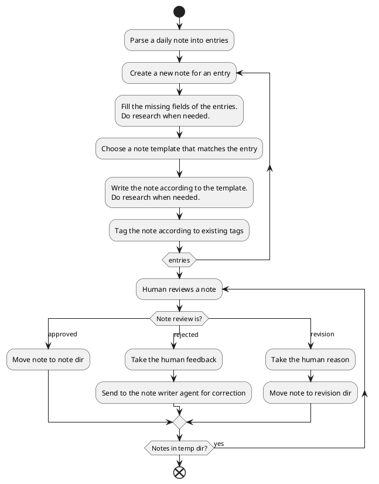
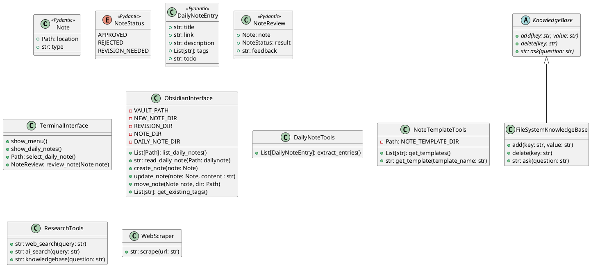

# ObsidianBoy Project Plan

## Project Overview
An AI-powered assistant (ObsidianBoy) that automates the process of managing knowledge in Obsidian. The goal is to transform daily note entries into compreghensive notes with full explanation and links to relevant resources. There are templates for different note types with hints how the template shall be filled. The solution will allow users to select daily notes to process, completes missing information of the daily note entries, perform research on daily note entries, create new discrete notes for each entry, tag them based on existing tags. There shall be a human review loop before finalizing changes. In the first iteration the interface will be terminal-based.

Obsidian background:
Obsidian is a note taking app that stores the notes as markdown files in a vault. In Obsidian daily notes are like bookmarks of ideas or inspirations used to capture findings or ideas. Usually daily notes contain a title, a link to relevant resources and a description, probably also tags and a task to remind the user on further exploration. Distilled notes are covering a bigger topic with more depth and are usually linking to related detailled notes.

## Envisoned Workflow

1. The terminal based interface allows the user to list and select daily notes to be processed.
2. Extract the daily note entries into DailyNoteEntries.
3. Loop over the entries.
4. Create a new note into the new dir.
5. If important fields of an entry are missing, try to fill the gaps with research:
   1. Generate a title based on the contents of the url, the description and tags.
   2. Find the link to main website based on the description, the tags and if needed a search for the title.
   3. Create a description based on the contents of the linked website
6. Match each new note to available note templates for different types of notes like tech-tool, business-idea, knowledge.
7. The note writer inspects the assigned template and researches the knowledge needed to fill the note template using the research tools. Valuable researched knowledge is stored in the knowledge base and then writes the note based on the template using the researched knowledge.
8. Tags new notes based on existing tags in the Obsidian vault
9. Have the new notes reviewed by the human
## Tools and Types
This a UML model for the tools and types. eThe types are sterotyped with <<Pydantic>>. 


### Details
#### ObsidianInterface
Handles all interactions with the Obsidian vault file system. It provides methods to deal with daily notes, notes and the tags existing in the Obsidian vault. The Note object contains their location so that they can be accessed in the file system. The directory they are stored in reflects the status of a not. If it is in the NEW_NOTE_DIR it is a new note. If it is in the REVISION_DIR it is a note that needs manual revision by the user. If it is in the NOTE_DIR it is a note that is approved by the user.
#### TerminalInterface
Provides a terminal-based interface for interacting with the ObsidianBoy system. It allows users to select daily notes, review notes. The note review displays the note content and allows the user to approve, reject, or request revision of the note. The rejection and revision request shall include a reason for the rejection or revision request entered by the user.
#### DailyNoteTools
Provides methods for extracting entries from a daily note.
#### NoteTemplateTools
Provides methods for listing and retrieving note templates. The name of a template describes the note type.
#### ResearchTools
Provides methods for web search, AI search, and knowledgebase search. 
- The web search performs a web search using a query and the result ususally conatains a list of websites and their descriptions. This is good to find websites related to a daily note or note. An agent can identify relevant results and then use the web scraper to get the content.
- The AI search is an AI based search tool which is expensive to use. It provides a refined result based on its own research. This is good if not much is known about the topic of a note. It might be useful to scrape the content of the links in the result to get more details.
- The knowledgebase question is a tool that answers question against a knowledge base related to a note. This is good if previous research about the note already collected a lot of knowleddge that had been stored in the knowledge base and can hereby be searched in the context of this note. You can see it as a searchable research cache. 
#### WebScraper
Responsible for scraping content from web resources to markdown. 
#### KnowledgeBase
Abstract base class for knowledge storage and retrieval. It adds knowledge related to a given key. The delete function deletes all knowledge related to key. The ask function answers questions against the knowledge base of a given key.
#### FileSystemKnowledgeBase
Concrete implementation of KnowledgeBase that stores the knowledge in the file system. The stored knowledge for a key will be loaded into the context of a cheap LLM to answer question.

## Solution Proposals
The solution is probably a mixture of fixed steps from the workflow while others may be better solved with an agentic approach. Probably LLM driven planning steps are beneficial. To be cost efficient the solution should use appropriate intelligent AI models for each step, ranging from simple and cheap models for easy tasks like summarization to more expensive capable models like planning. Probably memory should be added to the agents. All this has a huge impact on the technology choices. One candidate is to implement the solution with LangChain and LangGraph, the latter providing a graph based LLM control flow that allows a combination of single LLM executions and agent loops. Another contender is CrewAI, a multi-agent framework based on LangChain. CrewAI can be combined with LangGraph, crews could be executed by LangGraph nodes.


## Types and Templates
### The daily note entry type
```python
class DailyNoteEntry(BaseModel):
    title: Optional[str] = Field(description="Entry title (optional)")
    link: Optional[str] = Field(description="URL or markdown link (optional)")
    description: Optional[str] = Field(description="Brief description of the entry (optional)")
    tags: List[str] = Field(default_factory=list, description="List of tags (optional, default to empty list)")
    todo: Optional[str] = Field(default=None, description="Optional todo item (null if not present)")
```
Important fields that should be fileld if missing: title, link, description\

### Note template example
LLM hints for the content are in {{}}
tech-tool.md
```
---
created: {current date}
updated: {current date}
type: tech-tool
tags: {{tags}}
description: {{short description of the tech-tool}}
---
# Description
{{long description of the tech-tool}}
## Concepts
{{explanation of the concepts used by the tech-tool}}
## Usages
{{explanation of the usages of the tech-tool}}
# Resources
## Official
{{bulleted list of links to official resources: the project main website, source code, webapp, documentation, research papers}}
## Know-How
{{bulleted list of links to know-how resources: articles, courses, blog-posts, medium, substack, YouTube, podcasts, linkedin}}
```