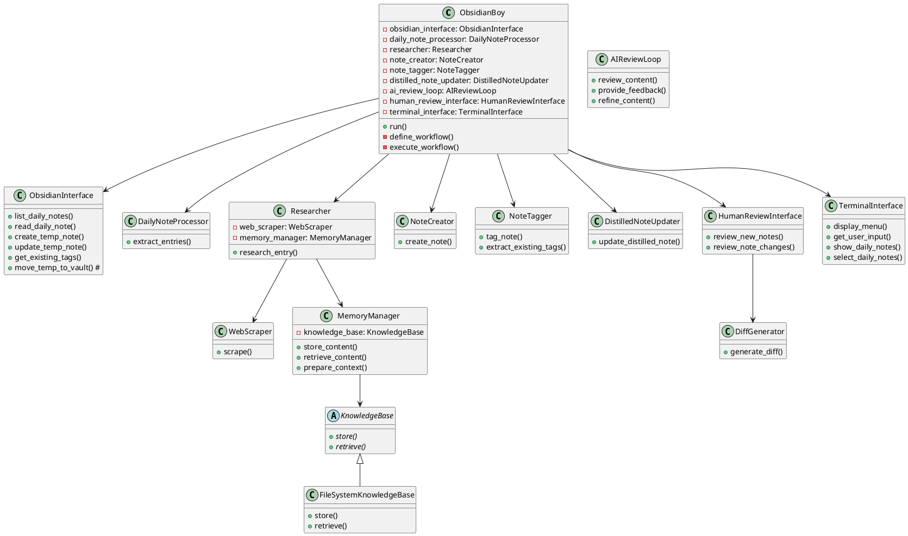

# ObsidianBoy Project Plan

## Project Overview

An AI-powered assistant (ObsidianBoy) that automates the process of managing knowledge in Obsidian. The goal is to transform daily note entries into compreghensive notes with full explanation and links to relevant resources. The solution will allow users to select daily notes to process, perform research on daily note entries, create new discrete notes for each entry, tag them based on existing tags, and update related distilled notes. There shall be an AI review feedback loop, followed by a final human review step before finalizing changes. In the first iteration the interface will be terminal-based.

Obsidian background:
Obsidian is a note taking app that stores the notes as markdown files in a vault. In Obsidian daily notes are like bookmarks of ideas or inspirations used to capture findings or ideas. Usually daily notes contain a title, a link to relevant resources and a description, probably also tags and a task to remind the user on further exploration. Distilled notes are covering a bigger topic with more depth and are usually linking to related detailled notes.

## Envisoned Workflow

1. The terminal based interface allows the user to list and select daily notes to be processed.
2. An LLM extracts entries from daily notes into a JSON format.
3. If important fields are missing, an LLM tries to fill the gaps like generating a title, finding the main website, summary of the entry.
4. An LLM classifies the entry and matches it to available note templates for different types of notes like tech-tool, business-idea, knowledge. The templates in markdown format are available in the file system and contain descriptions for the content of each section as a hint for the note writer LLM. 
5. The note writer LLM performs research on each entry using web search, scraping and content analysis to gather the needed information and then writes the note based on the template using the researched knowledge.
6. An LLM tags new notes based on existing tags in Obsidian
7. An LLM finds and updates relevant distilled notes
9. A feedback loop with an LLM review to ensure high quality
10. New notes and updated distilled notes sre stored in a temp directory and then presented to the human for review. For the distilled notes a diff with the changes is shown. The human can approve, reject or keep new notes in the temp dir for manual editing.

## Solution Proposals

The solution is probably a mixture of fixed steps from the workflow while others may be better solved with an agentic approach. Probably LLM driven planning steps are beneficial. To be cost efficient the solution should use appropriate intelligent AI models for each step, ranging from simple and cheap models for easy tasks like summarization to more expensive capable models like planning. Probably memory should be added to the agents. All this has a huge impact on the technology choices. One candidate is to implement the solution with LangChain and LangGraph, the latter providing a graph based LLM control flow that allows a combination of single LLM executions and agent loops. Another contender is CrewAI, a multi-agent framework based on LangChain. CrewAI can be combined with LangGraph, crews could be executed by LangGraph nodes.

## Architecture
This a a rough architecture draft, mostly covering the interface and the tools for agents. The knowledge base is an abstract class that allows a simple file based knowledge base approach where the researched knowledge is stored in files that subsequently could be added to the context of LLM requests. Another implementation could use RAG. Some classes and methods are placeholders because the agentic flow was unclear at the time. The tools are partly implemented.



## Class Descriptions

1. **ObsidianBoy**: The main class. It creates and manages instances of all other components. It instanciates all the tools and agents and implements the workflow and controls its execution. 

2. **ObsidianInterface**: Handles all interactions with the Obsidian vault file system.

3. **DailyNoteProcessor**: Processes daily notes and extracts entries.

4. **Researcher**: Orchestrates the research process for entries. It contains instances of WebScraper and MemoryManager.

5. **WebScraper**: Responsible for scraping content from web resources.

6. **KnowledgeBase**: Abstract base class for knowledge storage and retrieval.

7. **FileSystemKnowledgeBase**: Concrete implementation of KnowledgeBase that stores data in the file system.

8. **MemoryManager**: Manages the storage and retrieval of content, and prepares context for LLM processing. It has an instance of KnowledgeBase.

9. **NoteCreator**, **NoteTagger**, **DistilledNoteUpdater**: Handle various aspects of note creation and management.

10. **AIReviewLoop**: Implements the AI review feedback loop using LangGraph.

11. **HumanReviewInterface**: Handles the human review process, including presenting diffs for approval.

12. **DiffGenerator**: Generates diffs between original and updated notes.

13. **TerminalInterface**: Manages all terminal-based user interactions.

## Types and Templates
### The daily note entry type
```python
class DailyNoteEntry(BaseModel):
    title: Optional[str] = Field(description="Entry title (optional)")
    link: Optional[str] = Field(description="URL or markdown link (optional)")
    description: Optional[str] = Field(description="Brief description of the entry (optional)")
    tags: List[str] = Field(default_factory=list, description="List of tags (optional, default to empty list)")
    todo: Optional[str] = Field(default=None, description="Optional todo item (null if not present)")
```
Important fields that should be fileld if missing: title, link, description\

### Note template example
LLM hints for the content are in {{}}
tech-tool.md
```
---
created: {current date}
updated: {current date}
type: tech-tool
tags: {{tags}}
description: {{short description of the tech-tool}}
---
# Description
{{long description of the tech-tool}}
## Concepts
{{explanation of the concepts used by the tech-tool}}
## Usages
{{explanation of the usages of the tech-tool}}
# Resources
## Official
{{bulleted list of links to official resources: the project main website, source code, webapp, documentation, research papers}}
## Know-How
{{bulleted list of links to know-how resources: articles, courses, blog-posts, medium, substack, YouTube, podcasts, linkedin}}
```