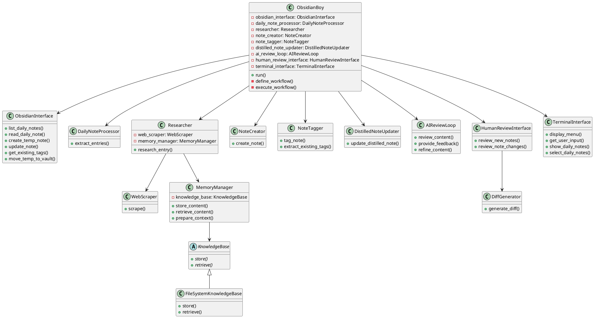

# ObsidianBoy: Updated Project Plan

## Project Overview

Develop an AI-powered assistant (ObsidianBoy) that automates the process of managing knowledge in Obsidian. The assistant will allow users to select daily notes to process, perform research on entries using a flexible research implementation, create new notes, tag them based on existing tags, and update distilled notes. It will use Anthropic's Claude API and include an AI review feedback loop using LangGraph, followed by a human review step before finalizing changes. The interface will be terminal-based.

## Requirements

1. List and allow selection of daily notes sorted by date
2. Process selected daily notes in Obsidian
3. Extract entries from daily notes
4. Perform research on each entry using web scraping and content analysis
5. Create new notes for each entry
6. Tag new notes based on existing tags in Obsidian
7. Update relevant distilled notes
8. Integrate with LangGraph for workflow management
9. Implement AI review feedback loop using LangGraph
10. Use LangChain with Anthropic's Claude API for AI model interaction
11. Access Obsidian vault files directly in the file system
12. Generate new files in a temporary directory for AI and human review
13. Provide a diff view for changes to existing notes
14. Allow human approval before finalizing changes
15. Operate entirely through a terminal-based interface

## Architecture

## Class Descriptions

1. **ObsidianBoy**: The main orchestrator class. It creates and manages instances of all other components. It defines and executes the overall workflow using LangGraph.

2. **ObsidianInterface**: Handles all interactions with the Obsidian vault file system.

3. **DailyNoteProcessor**: Processes daily notes and extracts entries.

4. **Researcher**: Orchestrates the research process for entries. It contains instances of WebScraper and MemoryManager.

5. **WebScraper**: Responsible for scraping content from web resources.

6. **KnowledgeBase**: Abstract base class for knowledge storage and retrieval.

7. **FileSystemKnowledgeBase**: Concrete implementation of KnowledgeBase that stores data in the file system.

8. **MemoryManager**: Manages the storage and retrieval of content, and prepares context for LLM processing. It has an instance of KnowledgeBase.

9. **NoteCreator**, **NoteTagger**, **DistilledNoteUpdater**: Handle various aspects of note creation and management.

10. **AIReviewLoop**: Implements the AI review feedback loop using LangGraph.

11. **HumanReviewInterface**: Handles the human review process, including presenting diffs for approval.

12. **DiffGenerator**: Generates diffs between original and updated notes.

13. **TerminalInterface**: Manages all terminal-based user interactions.

## Implementation Tasks for Aider

1. Implement ObsidianInterface class
   1. Implement method to list daily notes sorted by date
   2. Implement method to read daily notes from file system
   3. Implement method to create new notes in a temporary directory
   4. Implement method to update existing notes
   5. Implement method to retrieve existing tags
   6. Implement method to move files from temporary directory to Obsidian vault

2. Implement TerminalInterface class
   1. Implement method to display menu options
   2. Implement method to get user input
   3. Implement method to show list of daily notes
   4. Implement method to allow selection of daily notes

3. Implement DailyNoteProcessor class
   1. Create method to extract entries from daily notes
   2. Implement logic to parse entry format (name, link, description)

4. Implement KnowledgeBase abstract class
   1. Define abstract methods for storing and retrieving content

5. Implement FileSystemKnowledgeBase class
   1. Implement concrete methods for storing content in the file system
   2. Implement concrete methods for retrieving content from the file system

6. Implement WebScraper class
   1. Implement method to scrape content from a given URL
   2. Implement basic parsing logic to extract relevant information

7. Implement MemoryManager class
   1. Implement method to store content using KnowledgeBase
   2. Implement method to retrieve content from KnowledgeBase
   3. Implement method to prepare context for LLM processing

8. Implement Researcher class
   1. Integrate WebScraper and MemoryManager
   2. Implement research_entry method to orchestrate the research process
   3. Implement placeholder for LLM integration to extract section content

9. Implement NoteCreator class
   1. Create method to generate new note content based on research
   2. Integrate with FileSystemInterface to create the note in temp directory

10. Implement NoteTagger class
    1. Develop logic to suggest tags based on note content and existing tags
    2. Implement method to extract existing tags from a note
    3. Integrate with FileSystemInterface to apply tags to notes

11. Implement DistilledNoteUpdater class
    1. Create method to identify relevant distilled notes
    2. Implement logic to update distilled notes with new information

12. Implement AIReviewLoop class
    1. Define review_content method to analyze generated or updated notes
    2. Implement provide_feedback method to generate improvement suggestions
    3. Create refine_content method to apply AI-suggested improvements

13. Implement DiffGenerator class
    1. Create method to generate diff between original and updated notes

14. Implement HumanReviewInterface class
    1. Develop method to present AI-reviewed notes for human review in terminal
    2. Implement method to show diff and get approval for note changes in terminal

15. Implement ObsidianBoy class
    1. Set up integration with Anthropic's Claude API
    2. Implement define_workflow method using LangGraph to orchestrate all components
    3. Implement execute_workflow method to run the LangGraph workflow
    4. Implement main run method to initialize and execute the entire process
    5. Ensure proper sequencing of AI review before human review

16. Develop configuration management
    1. Create a configuration file for API keys, file paths, etc.
    2. Implement a configuration loader

17. Create integration tests
    1. Develop end-to-end tests that cover the entire workflow
    2. Create test fixtures and mock data for integration testing

18. Create main script
    1. Implement a main.py script to run ObsidianBoy

19. Document the code and create user guide
    1. Write docstrings for all classes and methods
    2. Create a README.md with setup and usage instructions

## Notes for Aider

- Task 1 (project setup) will be provided by the user
- For file system operations, use Python's built-in `os` and `shutil` modules
- To generate diffs, consider using the `difflib` module from Python's standard library
- When working with markdown files, you may want to use a library like `markdown` or `commonmark`
- Use a mocking library like `unittest.mock` or `pytest-mock` for creating test doubles
- Consider using a test runner like `pytest` for easier test organization and execution
- For the terminal interface, you can use Python's built-in `input()` function or a library like `prompt_toolkit` for more advanced features
- The ObsidianBoy class will be responsible for orchestrating all components using LangGraph. Implement the workflow as a series of steps that can be easily modified and extended
- Ensure proper error handling and API rate limiting when interacting with the Anthropic API
- For the AI review feedback loop, use LangGraph to create a multi-step review process that can iterate on content improvements
- When implementing the WebScraper, consider using libraries like `requests` for HTTP requests and `beautifulsoup4` for HTML parsing
- The KnowledgeBase abstraction allows for easy swapping of storage mechanisms in the future. Consider implementing a simple file-based storage first, with the option to extend to more complex systems later
- When implementing the MemoryManager, focus on preparing the context in a format that's easy for the LLM to process
- In the Researcher, ensure that the entry title is used as a prefix when storing content in the KnowledgeBase to avoid naming conflicts